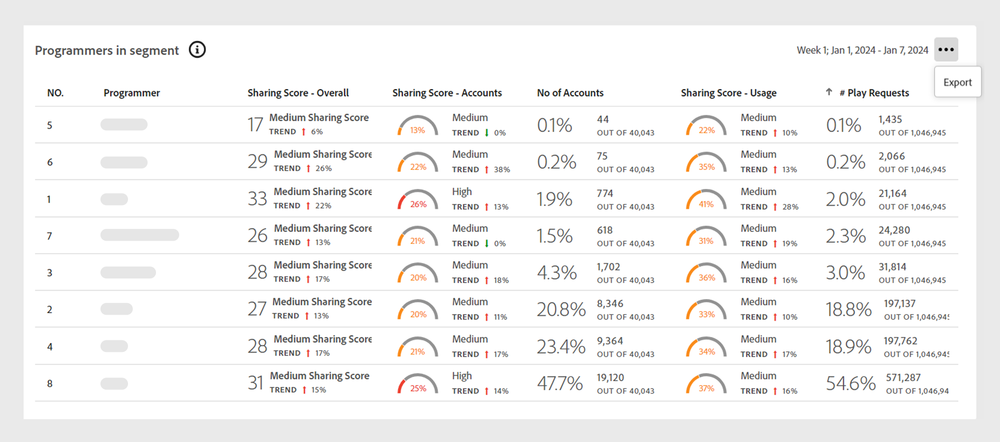

# Paneles de datos en el panel {#data-panels}

Una vez que haya seleccionado un segmento y un intervalo de tiempo, el panel muestra varios paneles de datos, tablas y gráficos que reflejan una vista de alto nivel de la actividad de uso compartido dentro del segmento seleccionado.

La siguiente tabla describe la disponibilidad y las diferencias entre los paneles de datos en diferentes [versiones](/help/accountiq/versions-aiq.md) de Account IQ:

| Paneles de datos | Servicios D2C | Programadores de TVE | MVPD de TVE |
|---|---|---|---|
| [Puntuación media de uso compartido agregada para el segmento actual](#aggregated-sharing) | Disponible y coherente | Disponible y coherente | Disponible y coherente |
| [Categorías de vídeo en el segmento](#video-categories-segment) | Disponible con ligeras variaciones | Disponible con ligeras variaciones | Disponible con ligeras variaciones |
| [Puntuación de uso compartido por canales y MVPD](#sharin-score-by-channels-and-mvpds) | No disponible | Disponible | No disponible |
| [Probabilidad de compartir cuentas](#accounts-sharing-probability) | Disponible y coherente | Disponible y coherente | Disponible y coherente |
| [Número de cuentas y uso compartido por nivel de probabilidad](#number-of-accounts-usage-sharing-probability) | Disponible y coherente | Disponible y coherente | Disponible y coherente |

## Puntuación media de uso compartido agregada para el segmento actual {#aggregated-sharing}

El panel Puntuación de uso compartido promedio proporciona una lectura de primera línea que resume la cantidad y el impacto del uso compartido en términos de cuentas y volumen de flujo continuo.

Las métricas le ayudan a comprender la magnitud (que va desde baja, media, alta a anormal) del uso compartido de credenciales por parte de sus suscriptores, medido en términos de cuentas y consumo.

*Puntuación media de uso compartido agregada por panel para el segmento actual*

>[!NOTE]
>
> El indicador azul en la **Puntuación media de uso compartido agregada para el segmento actual** tiene diferentes propósitos para los servicios D2C en comparación con TV Everywhere. Para los servicios D2C, representa el **Índice medio de servicio** como se muestra en la imagen anterior. Si inicia sesión como programador o MVPD, esta etiqueta cambia a **Índice medio del sector**.

Las siguientes métricas son componentes del panel Puntuación de uso compartido promedio.

### Nivel de uso compartido {#sharing-level}

El indicador de nivel de uso compartido muestra el porcentaje de todas las cuentas de suscriptor compartidas dentro del segmento definido durante el intervalo de tiempo seleccionado.

El porcentaje se calcula en función de la media de la probabilidad de compartir calculada para cada cuenta del segmento. Este cálculo incluye las cuentas que se han transmitido al menos una vez durante el intervalo de tiempo seleccionado.

El indicador de tendencia muestra el cambio porcentual en el valor de la métrica desde el intervalo de tiempo anterior.

{width="350" align="left"}

*Nivel de uso compartido*

### Uso de cuentas compartidas {#usage-from-shared-accounts}

La medición indica el porcentaje de uso de las cuentas compartidas entre todas las cuentas de suscriptores para el segmento y el periodo de tiempo definidos. Estos intervalos, denominados Bajo, Medio, Alto y Anormal, se basan en los promedios del sector.

El indicador de tendencia, que muestra un aumento o una caída en el uso de cuentas compartidas en comparación con el intervalo de tiempo anterior.

{width="350" align="left"}

*Uso de cuentas compartidas*

### Puntuación de uso compartido general {#overall-sharing-score}

La puntuación de uso compartido general es una combinación de puntuaciones de uso compartido, incluidos el &quot;Nivel de uso compartido&quot; y el &quot;Uso desde cuentas compartidas&quot;.

Proporciona una puntuación que refleja el impacto general del uso compartido. Su propósito es similar al de una puntuación crediticia, y resume el nivel de uso compartido con un solo número. Pero en este caso, una puntuación más alta indica un nivel de uso compartido mayor.

{width="350" align="left"}

*Puntuación de uso compartido general*

## Categorías de vídeo en el segmento {#video-categories-segment}

Puede seleccionar los encabezados de columna para ordenar los datos en todas las versiones de Account IQ.

Servicios de +++D2C: regiones en el segmento

Al iniciar sesión como un servicio D2C, **Regiones en el segmento** proporciona una vista comparativa de las diferentes puntuaciones de uso compartido agregadas para la [categorías de vídeo](/help/accountiq/product-concepts.md#video-category-def) en el segmento actual.

*Puntuación de uso compartido por regiones en el segmento*

>[!NOTE]
>
> El [categorías de vídeo](product-concepts.md#video-category-def)  se muestra en la imagen anterior, como **Regiones** en el segmento es solo un ejemplo. Cuando inicia sesión en Account IQ, este panel muestra la categoría de vídeo específica de su empresa.

Seleccionar **Exportar** para descargar los datos en un archivo .csv. Aprender [cómo exportar informes del panel de datos](/help/accountiq/export-reports.md).

+++

+++Programadores: MVPD en el segmento

Cuando inicia sesión como programador, **MVPD en el segmento** proporciona una vista comparativa de las diferentes puntuaciones de uso compartido agregadas para las MVPD en el segmento actual.

Seleccionar **Exportar** para descargar los datos en un archivo .csv. Aprender [cómo exportar informes del panel de datos](/help/accountiq/export-reports.md).

+++

+++MVPD: Programadores en el segmento

Cuando inicia sesión como MVPD, **Programadores en el segmento** proporciona una vista comparativa de las diferentes puntuaciones de uso compartido agregadas para los programadores del segmento actual.

Seleccione los encabezados de columna para ordenar los datos.

*Puntuación de uso compartido por programadores en el segmento*

Seleccionar **Exportar** para descargar los datos en un archivo .csv. Aprender [cómo exportar informes del panel de datos](/help/accountiq/export-reports.md).

+++

## Puntuación de uso compartido por canales y MVPD  {#sharin-score-by-channels-and-mvpds}

Al iniciar sesión como programador, esta tabla proporciona una vista comparativa de las puntuaciones de uso compartido de los canales seleccionados para las MVPD del segmento actual.

Seleccione los encabezados de columna para ordenar los datos.

*Uso compartido de puntuaciones por canales y MVPD*

## Probabilidad de compartir cuentas {#accounts-sharing-probability}

Este gráfico divide las cuentas en rangos de quintiles de probabilidad de uso compartido, que van desde muy bajos (0-20%) a muy altos (80-100%). Más información sobre los rangos de [Probabilidad de uso compartido de cuentas](#accounts-sharing-probability).

>[!NOTE]
>
>El gráfico de barras utiliza una escala logarítmica.

*Números y porcentajes de cuentas de suscriptor en diferentes intervalos de probabilidad de uso compartido*

## Número de cuentas y uso compartido por nivel de probabilidad {#number-of-accounts-usage-sharing-probability}

Este panel proporciona una vista tabular de las cuentas divididas en rangos de quintiles de probabilidad de uso compartido, que van desde muy bajos (0-20%) a muy altos (80-100%), con el uso asociado de cada quintil desde cuentas compartidas. Más información sobre los rangos de [Probabilidad de uso compartido de cuentas](#accounts-sharing-probability).

*Número de cuentas, tendencias y usos que caen en varios rangos de probabilidad*

Seleccionar **Exportar** para descargar los datos en un archivo .csv. Aprender [cómo exportar informes del panel de datos](/help/accountiq/export-reports.md).

