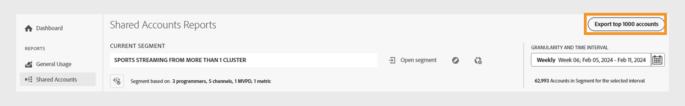

# Exportar información para cuentas con una puntuación de uso compartido alta {#export-account-info-high-score}

[!UICONTROL Account IQ] permite exportar los detalles de uso compartido de cuentas de las 1000 cuentas de suscriptores principales en función de su [compartir probabilidades](/help/accountiq/product-concepts.md#account-sharing-probability-def). Puede exportar la información de uso compartido de cuentas del actual [segmento](/help/accountiq/product-concepts.md#segment-def) y [intervalo de tiempo especificado](/help/accountiq/product-concepts.md#time-interval-def) en el [Informes de cuentas compartidas](/help/accountiq/shared-acc-reports.md) página.

Siga los pasos para exportar la información de uso compartido de cuentas de las cuentas de suscriptor de un segmento específico.

1. Inicie sesión con sus credenciales.
1. Vaya a **Cuentas compartidas** pestaña debajo de **Informes** sección.
1. Seleccione el segmento y el intervalo de tiempo necesarios en el panel Segmento e intervalo de tiempo. Aprender [cómo seleccionar un segmento y un intervalo de tiempo](segments-timeinterval.md).

   Si es necesario, consulte las instrucciones de [creación de segmentos](work-with-segments.md#create-new-segment) o [edición de segmentos](work-with-segments.md#edit-segment).

1. Seleccionar **[!UICONTROL Export top 1000 accounts]** situado en la esquina superior derecha del panel segmento e intervalo de tiempo.

   

   *Seleccione la opción Exportar las 1000 cuentas principales*

El archivo se descargará automáticamente en el equipo local como un .csv.

Este archivo contiene los datos de las 1000 cuentas principales en función de las probabilidades de uso compartido de las cuentas de suscriptor del segmento actual en orden decreciente.

A continuación se muestra un ejemplo del archivo .csv exportado.

*Datos exportados en el archivo .csv*

## Columnas del informe exportado {#columns-in-export}

**Semana/Mes**

La semana o el mes seleccionados dentro del **[!UICONTROL Granularity and Time Interval]** en el selector de segmentos.

**MVPD**

Si es programador, la columna muestra el distribuidor con el que está suscrita la cuenta.

>[!NOTE]
>
> El **MVPD** solo está disponible para las versiones de TV en todas partes.

**Identificador de suscriptor**

El identificador único de la cuenta específica.

**Cantidad mínima de dispositivos**

Número mínimo de dispositivos desde los que los usuarios transmiten contenido de forma activa.

>[!NOTE]
>
>El número real de dispositivos que transmiten contenido es mayor que el número mínimo de dispositivos especificado para una cuenta en particular.

**Cantidad mínima de personas**

El número mínimo de personas que retransmitieron contenido de forma activa mediante esos dispositivos.

>[!NOTE]
>
>El número real de personas que transmiten contenido es mayor que el número mínimo de personas asignadas a una cuenta determinada.

**[!UICONTROL # IPs]**

El número de direcciones IP desde las que se transmite el contenido.

**[!UICONTROL # Locations]**

El número de ubicaciones (según el código postal) desde las que se transmite el contenido.

**[!UICONTROL # Cities]**

El número de ciudades en las que se ha producido la actividad de streaming.

**[!UICONTROL # States]**

El número de estados en los que se ha producido la actividad de flujo continuo.

**[!UICONTROL # Clusters]**

El número de diferentes [clústeres](/help/accountiq/product-concepts.md#cluster-def) donde se ha producido la transmisión.

**[!UICONTROL Geographic span (miles)]**

La distancia máxima entre las ubicaciones de streaming asociadas con la cuenta.

**[!UICONTROL # AuthN OK]**

El número de inicios de sesión que los usuarios realizan durante el período especificado con esa cuenta.

>[!NOTE]
>
> Es posible que algunos servicios D2C no vean **[!UICONTROL # AuthN OK]** ya que es posible que no se incluyan en los datos de su empresa.

**[!UICONTROL # AuthZ OK]**

El número de veces que un MVPD ha autorizado un flujo o ha concedido acceso al contenido de esa cuenta.

>[!NOTE]
>
>**[!UICONTROL # AuthZ OK]** no está disponible para los servicios D2C.

>[!NOTE]
>
>Para TV en todas partes, **[!UICONTROL # AuthZ OK]** se correlaciona con el número de **[Nº de solicitudes de reproducción](/help/accountiq/product-concepts.md##play-requests-def)**. Siempre será menor que **[!UICONTROL # Play Requests]** porque el Adobe generalmente almacena en caché las autorizaciones de MVPD durante aproximadamente 24 horas.

**[!UICONTROL # Play Requests]**

El número real de flujos se produjeron durante un período de tiempo especificado.

>[!NOTE]
>
>El [Nº de solicitudes de reproducción](/help/accountiq/product-concepts.md##play-requests-def) no está disponible en la versión de MVPD de TV Everywhere.

**[!UICONTROL # Channels]**

El número total de canales que la cuenta ha visto durante un periodo especificado.

>[!NOTE]
>
> Para servicios D2C **[!UICONTROL # Channels]** es equivalente al número de **[!UICONTROL # Video categories]**.

>[!NOTE]
>
>Para TV Everywhere, incluyen los canales que pueden no pertenecer al programador que ha iniciado sesión. Este número de la cuenta incluye el canal y otros canales a los que se accedió durante el periodo especificado.

**Patrón de uso**

Los valores dentro de estas columnas sirven como identificadores correspondientes a uno de los 14 patrones que utilizamos para categorizar todas las cuentas de usuario.

<table>
    <tbody>
      <tr>
        <th style="width:10%">ID</th>
        <th style="width:30%">Patrones de uso</th>
      </tr>
      <tr>
        <td>1</td>
        <td>Usuario normal</td>
      </tr>
      <tr>
        <td>2</td>
        <td>Viajero o viajero</td>
      </tr>
      <tr>
        <td>3</td>
        <td>Familia numerosa</td>
      </tr>
      <tr>
        <td>4</td>
        <td>Familias y amigos cercanos</td>
      </tr>
      </tr>
         <td>5 y 8</td>
         <td>Uso compartido de grupos sociales</td>
      </tr>
      </tr>
         <td>6</td>
         <td>Gran grupo de amigos</td>
      </tr>
      </tr>
         <td>7</td>
         <td>Flujo simultáneo</td>
      </tr>
      </tr>
         <td>9</td>
         <td>Uso compartido de comunidades</td>
      </tr>
      </tr>
         <td>10 y 11</td>
         <td>Comportamiento incierto</td>
      </tr>
      </tr>
         <td>12</td>
         <td>Familia pequeña</td>
      </tr>
      </tr>
         <td>13</td>
         <td>Segunda casa </td>
      </tr>
      </tr>
         <td>14</td>
         <td>Uso anormal</td>
      </tr>
    </tbody>
  </table>

*Identificadores de patrón de uso en la asignación .csv exportada con patrones de uso*

**Probabilidad de uso compartido**

La probabilidad de que una cuenta específica comparta sus credenciales.

>[!NOTE]
>
> La media de la probabilidad de compartir de todas las cuentas del segmento seleccionado se utiliza para calcular la [nivel de uso compartido](/help/accountiq/data-panels.md#sharing-level) de la [puntuación media de uso compartido](/help/accountiq/data-panels.md#aggregated-sharing).
