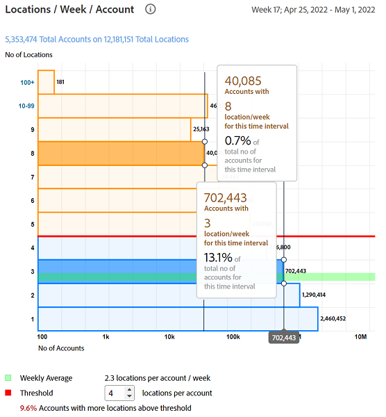

# [!UICONTROL General usage] informes {#general-usage-reports}

[!UICONTROL Account IQ] los informes son herramientas de análisis básicas que permiten explorar en profundidad los datos para aislar [cohortes](/help/accountiq/product-concepts.md#segmet-def), identifique anomalías y comprenda las características de la cuenta.

[!UICONTROL General usage] La página Informes proporciona herramientas para crear métricas de subgrupos en función del número de dispositivos de cuenta en uso, las direcciones IP detectadas y sus respectivos códigos postales.

Todos los informes se basan en el segmento actual seleccionado del [Segmentos e intervalo de tiempo](/help/accountiq/segments-timeinterval.md) panel. Puede ajustar la selección y reducirla aún más especificando umbrales (número de dispositivos, número de direcciones IP y número de códigos postales) en [Resumen de Instantáneas: Cuentas por encima de los umbrales](#snapshot-overview) panel.

## Solicitudes de reproducción y suscriptores únicos {#playreq-uniquesubs}

Los gráficos de líneas aquí le proporcionan una vista de los cambios a lo largo del tiempo de los valores, como Solicitudes de reproducción y Suscriptores únicos en un intervalo de tiempo seleccionado para el segmento definido.

+++ Servicios D2C: Solicitudes de reproducción/suscriptores únicos

*Solicitudes de reproducción/suscriptores únicos para servicios D2C*

+++

+++Programadores: Solicitudes de reproducción/suscriptores únicos

*Solicitudes de reproducción/suscriptores únicos para programadores*

+++

+++MVPD: Suscriptores únicos

*Suscriptores únicos para MVPD*

+++

 

El eje x representa el tiempo en función del intervalo actual y el eje y representa las métricas básicas de actividad del suscriptor durante ese período. Los gráficos de líneas le ayudan a visualizar y comparar la actividad de los suscriptores del segmento actual. Según la versión de Account IQ, las métricas incluyen:

* **AuthN OK**: número de autenticaciones correctas. Más información sobre [AuthN OK](/help/accountiq/product-concepts.md#authn-ok-def).

* **AuthZ OK**: Número de autorizaciones correctas. Más información sobre [AuthZ OK](/help/accountiq/product-concepts.md#authz-ok-def).

* **Solicitudes de reproducción**: Número de solicitudes de reproducción. Más información sobre [Solicitudes de reproducción](/help/accountiq/product-concepts.md#play-requests-def).

* **Suscriptores únicos**: Número de suscriptores únicos correctos. Más información sobre [Suscriptores únicos](/help/accountiq/product-concepts.md#unique-subscriber-def).

>[!NOTE]
>
>La disponibilidad de las métricas varía según la versión de Account IQ.

## Resumen de instantáneas: cuentas por encima de los umbrales {#snapshot-overview}

Ajuste los análisis e informes con este filtro adicional para establecer varios umbrales de uso. Una vez que haya seleccionado un segmento, también puede utilizar los siguientes filtros para analizar más a fondo el comportamiento del suscriptor:

* Umbral de número de dispositivos

* Umbral de número de direcciones IP

* Umbral de número de códigos postales

Cuando se actualizan los valores de umbral en [Cuentas basadas en segmentos en los umbrales seleccionados](#account-segments-basedon-segments) , verá el efecto en:

* [Dispositivos por semana (o mes) por cuenta](#devices-week-account)

* [Ubicaciones por semana (o mes) por cuenta](#locations-week-account)

* [IP por semana (o mes) por cuenta](#ip-week-account)

* [Vista histórica del segmento de cuentas](#account-segment-historical-view)

>[!NOTE]
>
>Cada umbral se establece con un valor predeterminado de 4. Lo que significa que la página Uso general muestra un análisis para los suscriptores que utilizan más de cuatro dispositivos y consumen contenido de más de cuatro direcciones IP diferentes. *y* más de cuatro códigos postales diferentes.

### Cuentas basadas en segmentos según los umbrales seleccionados {#account-segments-basedon-segments}

El **Cuentas basadas en segmentos en los umbrales seleccionados** El panel le ofrece opciones para establecer umbrales (entre 1 y 10) para el número de dispositivos, el número de direcciones IP y el número de códigos postales.

El gráfico muestra lo siguiente:

* Número absoluto de cuentas de suscriptor.

* Porcentaje del total de cuentas de suscriptor en el segmento que utilizan el número de dispositivos, desde el número de direcciones IP, en el número de códigos postales según se especifican en los umbrales.

## Dispositivos por semana (o mes) por cuenta {#devices-week-account}

Este gráfico de barras proporciona información sobre el comportamiento de uso en términos de cómo los suscriptores utilizan sus dispositivos para acceder al contenido.

El eje x representa el número de cuentas y el eje y el número de dispositivos. En función del umbral que establezca para el número de dispositivos por cuenta, marca el número absoluto de cuentas de suscriptores que consumen contenido de un número específico de dispositivos en una semana.

Al pasar el ratón por encima de una barra (específica del número de dispositivos), aparece una etiqueta que proporciona información sobre el número de cuentas de suscriptor (y el porcentaje del total de cuentas de suscriptor en el segmento) que están transmitiendo contenido de canal mediante esos dispositivos en una semana.

El gráfico también marca lo siguiente:

* Una línea roja para marcar el umbral establecido.

* Una línea verde para marcar el promedio del número de dispositivos diferentes utilizados por una cuenta de suscriptor por semana (o mes).

El anillo proporciona una vista alternativa de los dispositivos que utilizan las cuentas del segmento actual por encima del umbral establecido.

## Ubicaciones por semana (o mes) por cuenta {#locations-week-account}

Similar a la métrica para [Dispositivos por semana (o mes) por cuenta](#devices-week-account), la métrica Ubicaciones por semana (o mes) y por cuenta permite analizar el uso de la cuenta del suscriptor desde diferentes ubicaciones. El eje x representa el número de cuentas y el eje y el número de ubicaciones.

Una vez establecido el umbral para el número de ubicaciones, puede utilizar el gráfico para identificar lo siguiente:

* Número (y porcentaje) de suscriptores que consumen contenido de (una ubicación específica) x número de ubicaciones en una semana.

* Porcentaje del total de cuentas de suscriptor que están viendo contenido desde más ubicaciones que el umbral.

* Comparar el promedio semanal (número de ubicaciones diferentes para una cuenta) con el umbral.

## IP por semana (o mes) por cuenta {#ip-week-account}

Similar a la métrica para **Número de ubicaciones por semana por cuenta**, el **Número de direcciones IP por semana por cuenta** Esta métrica le permite evaluar la cantidad de cambio en el origen de la transmisión para el segmento actual.

El eje x representa el número de cuentas y el eje y el número de direcciones IP.

Una vez definido un segmento y establecido el umbral para el número de direcciones IP, puede utilizar el gráfico para identificar lo siguiente:

* Número (y porcentaje) de suscriptores que consumen contenido de una cantidad específica de IP en una semana.

* Porcentaje del total de cuentas de suscriptor que están viendo contenido desde más direcciones IP que el umbral.

* Comparar el promedio semanal (número de direcciones IP diferentes para una cuenta) con el umbral.

## Vista del historial de segmentos de cuentas {#account-segment-historical-view}

El gráfico de barras Vista histórica le ayuda a comparar las métricas de uso en diferentes intervalos de tiempo. Además, traza colectivamente las distintas métricas de uso, como [Dispositivos por semana (o mes) por cuenta](#devices-week-account), [Ubicaciones por semana (o mes) por cuenta](#locations-week-account), y [IP por semana (o mes) por cuenta](#ip-week-account).

* El eje x representa el intervalo de tiempo y el eje y representa el número de cuentas de suscriptor, dispositivos, ubicaciones e IP.

* Las barras de color naranja significan segmentos en varios intervalos de tiempo.

* El gráfico de líneas representa los cambios en [Dispositivos por semana (o mes) por cuenta](#devices-week-account), [Ubicaciones por semana (o mes) por cuenta](#locations-week-account), y [IP por semana (o mes) por cuenta](#ip-week-account) valores a lo largo del intervalo de tiempo en función del umbral.

* Las barras azules indican el número total de suscriptores activos en todo el sector durante un intervalo de tiempo.

* Puede seleccionar leyendas específicas, que le ayudarán a escalar el gráfico.

