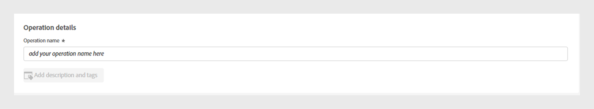

# Operaciones {#operations-tab-next-steps}

Una vez que haya analizado los patrones de uso de su suscriptor y haya identificado instancias de uso compartido de contraseñas para un segmento seleccionado mediante [!DNL Account IQ] análisis, puede realizar acciones dirigidas mediante procedimientos centrados llamados operaciones en [!DNL Account IQ].

Las **operaciones** le permiten realizar un seguimiento y administrar de manera eficaz el uso compartido de credenciales hacia un grupo de cuentas para mitigar el uso compartido de contraseñas y mejorar la experiencia de los suscriptores más valiosos.

Puede aplicar acciones a un [segmento](/help/accountiq/product-concepts.md#segment-def) definido para direccionar el uso compartido de contraseñas en un [intervalo de tiempo](/help/accountiq/product-concepts.md#time-interval-def) específico y programar la operación para que se ejecute en una fecha futura. Estas acciones incluyen restricciones para minimizar el uso compartido de contraseñas o aliviar las restricciones en cuentas que no comparten.

Con las operaciones no solo se especifican acciones y su ámbito, sino que también se miden sus resultados.

Al evaluar los resultados, puede refinar su estrategia para optimizar los efectos, ya sea convirtiendo a los prestatarios, mitigando el uso compartido de las credenciales o reduciendo la pérdida.

Puede realizar varias funciones con las siguientes operaciones:

* [Ver informes de operaciones](#operation-reports)
* [Crear una nueva operación](#create-new-operation)
* [Detener operación](#stop-operation)

## Ver informes de operaciones {#operation-reports}

Puede revisar los efectos de una operación mediante los informes de operaciones. Para ver el informe de la operación, seleccione la ficha **Operaciones** en **Acciones** en el panel izquierdo de la aplicación de Account IQ. Se muestra una lista de las operaciones disponibles en el sistema. Puede acceder a los detalles clave de cada operación en formato de tabla. Los detalles incluyen:

* Nombre de la operación
* Estado actual (como Programado, En ejecución, Finalizado, Error o Detenido)
* Porcentaje de progreso completado
* Audiencia o segmento de destino en el que se aplica la operación
* Tipo de acción seleccionada para la operación
* Fecha de inicio de la operación
* Fecha de finalización de la operación
* Fecha de creación de la operación
* Fecha de la última modificación de la operación

*Lista y detalles de operaciones existentes en Account IQ*

Seleccione el **Nombre de operación** que desee en la lista de operaciones. Se muestran los siguientes informes:

### Rendimiento de operación {#operation-performance}

El rendimiento de la operación proporciona una lectura de primera línea que resume el número de cuentas afectadas, el progreso de la operación y la puntuación de uso compartido general de las cuentas en el segmento durante el [período de evaluación](/help/accountiq/product-concepts.md#evaluation-period-def) de la operación.

*Informe de rendimiento de la operación*

**A.** Cuentas afectadas **B.** Progreso de la operación **C.** Puntuación general de uso compartido

#### Cuentas afectadas {#impacted-accounts}

Este número muestra el recuento de cuentas de suscriptor afectadas por la acción realizada durante el periodo de evaluación de la operación.

#### Progreso de operación {#operation-progress}

Este indicador muestra el número de días y el porcentaje de la operación finalizada fuera de la programación planificada.

#### Puntuación de uso compartido general {#overall-sharing-score}

Este gráfico de líneas representa la [puntuación general de uso compartido](/help/accountiq/data-panels.md#overall-sharing-score), que incluye el nivel de uso compartido y el uso de cuentas compartidas en cada semana durante el período de evaluación de la operación.

### Impacto de la operación: cuentas en el segmento {#impact-accounts}

Este informe se muestra como un gráfico de columnas apiladas que ilustra el impacto de una operación a lo largo del tiempo.

*Impacto de la operación en las cuentas en el gráfico de segmentos*

El eje x representa el [período de evaluación](/help/accountiq/product-concepts.md#evaluation-period-def) de la operación, mientras que el eje y indica el estado de las cuentas en el segmento de la operación. Cada barra del gráfico está dividida en tres colores:

* Rosa representa el número de cuentas que cumplen las condiciones del segmento utilizado en esta operación.

* Azul representa el número de cuentas activas que originalmente estaban en el segmento, pero que no cumplían las condiciones del segmento durante cada semana o mes del [período de evaluación](/help/accountiq/product-concepts.md#evaluation-period-def) de la operación.

* Gris representa las cuentas inactivas durante el período de evaluación.

>[!NOTE]
>
>La primera barra rosa representa el número de cuentas que cumplen las condiciones del segmento de operación al principio del período de evaluación.

Con el tiempo, el gráfico ilustra los cambios en el comportamiento de la cuenta en relación con los criterios originales (por ejemplo, si tiene una probabilidad de compartir más de 90 y utiliza más de 5 dispositivos, habrá quedado inactivo).

### Impacto de la operación: métricas de cuentas compartidas {#impact-shared-accounts}

Las métricas de cuentas compartidas proporcionan una visión general del nivel de uso compartido y las solicitudes de reproducción de las cuentas de suscriptor en el segmento de la operación durante el [período de evaluación](/help/accountiq/product-concepts.md#evaluation-period-def) de la operación.

#### Nivel de uso compartido {#share-level}

Este gráfico de líneas representa el [nivel de uso compartido](/help/accountiq/data-panels.md#sharing-level) cada semana durante el período de evaluación de la operación.

{width="550" align="left"}

*Gráfico de líneas de nivel de uso compartido*

#### Número de solicitudes de reproducción {#play-requests}

Este gráfico de líneas representa las [solicitudes de reproducción](/help/accountiq/general-usage-reports.md#playreq-uniquesubs) cada semana en el período de evaluación de la operación.

{width="550" align="left"}

*Número de solicitudes de reproducción en el gráfico de líneas*

### Impacto de la operación: métricas de uso generales {#impact-general-usage}

Las métricas de uso generales proporcionan una visión general del número promedio de dispositivos, direcciones IP y ubicaciones en el segmento de la operación durante el [período de evaluación](/help/accountiq/product-concepts.md#evaluation-period-def) de la operación.

#### Número de dispositivos {#devices}

Este gráfico de líneas representa el promedio [número de dispositivos](/help/accountiq/general-usage-reports.md#devices-week-account) cada semana en el período de evaluación de la operación.

{width="550" align="left"}

*Gráfico de líneas de número de dispositivos*

#### Número de direcciones IP y ubicaciones {#IPs-locations}

Este gráfico de líneas representa el promedio [número de IP](/help/accountiq/general-usage-reports.md#ip-week-account) y [ubicaciones](/help/accountiq/general-usage-reports.md#locations-week-account) cada semana en el período de evaluación de la operación.

{width="550" align="left"}

*Número de IP y gráfico de líneas de ubicaciones*

Para cerrar el informe y volver a la página principal de **Operaciones**, seleccione la pestaña **Operaciones** en **Acciones** en el panel izquierdo.

## Crear nueva operación {#create-new-operation}

Cuando vaya a la ficha **Operaciones** en **Acciones** en el panel izquierdo, seleccione **Crear nueva operación** en la parte superior de la página **Operaciones**.

Para crear una nueva operación, siga las instrucciones de las secciones siguientes:

* [Detalles de operación](#operation-details)
* [Segmento](#segment)
* [Acción](#action)
* [Programación](#schedule)

### Detalles de operación {#operation-details}

En esta sección, escriba el nombre de la operación en **Nombre de operación**.

>[!TIP]
>
>Describa el propósito de la operación o la naturaleza de la acción en **nombre de operación** para una identificación rápida. La opción **Agregar descripción y etiquetas** estará disponible en futuras versiones.

*Agregar nombre de operación*

### Segmento {#segment}

En esta sección, haga clic en **Seleccionar segmento** y elija el segmento al que desea utilizar esta operación. Obtenga información sobre [cómo seleccionar un segmento](/help/accountiq/segments-timeinterval.md#segment-selection).

Una vez seleccionado un segmento, utilice el Icono  para ver el resumen detallado del segmento. Más información sobre [resumen del segmento](segments-timeinterval.md#segment-summary).

*Seleccionar segmento e intervalo de tiempo*

>[!NOTE]
>
>Las [categorías de vídeo](product-concepts.md#video-category-def) mostradas en la imagen anterior, como **MVPD**, **Programadores** y **Canales** representan las etiquetas usadas en la versión de TV Everywhere de Account IQ. Si ha iniciado sesión como servicio D2C, estas etiquetas muestran las categorías de vídeo específicas de su empresa.

Si es necesario, utilice Icono  para editar el segmento seleccionado o  Icono  para crear un nuevo segmento. Para obtener más información, consulte las instrucciones para [crear un nuevo segmento](work-with-segments.md#create-new-segment) o [editar un segmento](work-with-segments.md#edit-segment).

>[!IMPORTANT]
>
>**El tipo de segmento** denominado **[!UICONTROL Fixed number of accounts]** está seleccionado actualmente de forma predeterminada. La opción de seleccionar **[!UICONTROL Variable number of accounts]** estará disponible en próximas versiones.

Seleccione **Granularidad e intervalo de tiempo** para supervisar la operación durante un período específico. Más información sobre [cómo seleccionar la granularidad y el intervalo de tiempo](/help/accountiq/segments-timeinterval.md#granularity-timeinterval).

### Acción {#action}

En esta sección, elija una **acción** que desee realizar en el segmento seleccionado del menú desplegable.

*Seleccione el tipo de acción*

Hay dos opciones disponibles:

* Seleccione **Política de CM** para el sistema de supervisión de concurrencia integrado con Account IQ.

* Seleccione **Acciones externas** para crear y procesar flujos de trabajo externos a Account IQ y no integrados con el sistema de Account IQ.

>[!NOTE]
>
>Es posible que las acciones externas no siempre estén directamente relacionadas con el uso compartido de contraseñas, pero aún así pueden afectarlo, como el inicio de una nueva temporada.

### Programación {#schedule}

En esta sección, seleccione **Fecha de inicio** y **Fecha de finalización** del selector de fechas para establecer la activación de la operación.

>[!IMPORTANT]
>
>Actualmente, la activación predeterminada **Fecha de inicio** y **Fecha de finalización** están configuradas en **Fecha de finalización**. La opción de seleccionar **Cuando se cumpla una condición** y **Manualmente** estará disponible en próximas versiones.

>[!NOTE]
>
>Asegúrese de que tanto la fecha de inicio como la de finalización se alinean con la granularidad seleccionada para la evaluación en **Paso 4**.

* Si ha optado por la granularidad acumulada por semanas, seleccione las fechas de inicio y finalización en semanas (por ejemplo, la semana 10).
* Si ha optado por la granularidad acumulada por meses, seleccione las fechas de inicio y finalización en meses.

*Seleccione la fecha de inicio y la fecha de finalización del selector de fechas*

**A.** Selector de fecha de inicio **B.** Selector de fecha de finalización

>[!NOTE]
>
>La **fecha de inicio** debe ser posterior al período de evaluación y a la fecha actual, mientras que la **fecha de finalización** debe ser posterior a la fecha de inicio y a la fecha actual para programar y ejecutar operaciones en el período futuro.

Seleccione **Guardar operación** en la parte superior de la página **Operaciones** para procesar una nueva operación.

## Detener operación {#stop-operation}

Solo puede detener las operaciones que están actualmente en **En ejecución**. Para detener una operación existente, siga estos pasos:

1. Vaya a la ficha **Operaciones** en **Acciones** en el panel de navegación izquierdo de la aplicación Account IQ.
1. Seleccione el menú **Opciones** de la operación que desee detener.

   

   *Seleccione el menú Opciones para detener la operación*

1. Seleccione **Detener**.

