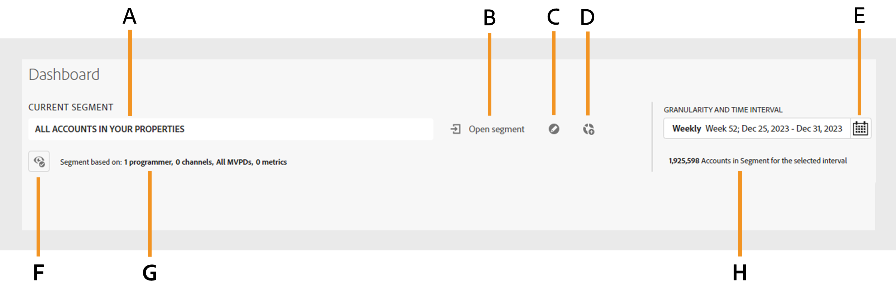

# Segmentos de suscriptor e intervalo de tiempo {#cohorts-segments}

Cuando inicia sesión en Account IQ, el panel del iniciador de segmentos en la parte superior le permite especificar el suscriptor [segmento](/help/accountiq/product-concepts.md#segment-segmet-def). Esto ayuda a filtrar los resultados al ver informes sobre el comportamiento y los patrones de uso compartido de los suscriptores. Ya hay seleccionado un segmento predeterminado denominado Todas las cuentas en sus propiedades y verá las siguientes opciones en el lanzador de segmentos:

{width="800" align="left"}

*Imagen: lanzador de segmentos con el resumen de segmentos contraído*

**A** Nombre del segmento seleccionado actualmente 
**B** Selector de intervalo de tiempo y granularidad 
**C** Resumen de segmentos contraído 
**D** Opción para expandir el resumen del segmento 
**E** Datos del segmento (en términos de número de cuentas de suscriptor en el segmento durante un tiempo) 
**F** Opción Abrir lista de segmentos 
**G** Opción Editar segmento 
**H** Opción Crear nuevo segmento 

## Selección de segmentos {#segment-selection}

Para los usuarios de programadores o MVPD, vaya a la **Abrir segmento** opción. Elija un segmento de la lista y seleccione **Abrir segmento** para ver los informes de uso compartido de cuentas.

Utilice el **Ojo** para ver el resumen detallado del segmento, presentando la información sobre el número de cuentas de suscriptor y las solicitudes de reproducción realizadas por ellas dentro del intervalo de tiempo seleccionado.

+++Panel de selección de segmentos para programadores/MVPD

 {width="800" align="left"}

*Figura: Panel de segmentos para programadores/MVPD*

+++

El resumen del segmento se utiliza para definir los siguientes parámetros:

**[!UICONTROL Programmers in segment]**

**[!UICONTROL Channels in segment]**

**[!UICONTROL MVPD in segment]**

**[!UICONTROL Metrics in segment]**

<!-- The definitions of these parameters will be defined in the glossary article-->

## [!UICONTROL Granularity and time interval] {#granularity-timeinterval}

El **[!UICONTROL Granularity and time interval]** El selector de permite especificar las fechas y la duración agregadas de forma semanal o mensual para observar el comportamiento de uso compartido de la cuenta del suscriptor. La selección predeterminada del intervalo de tiempo es la semana actual, pero puede modificar la duración con las opciones que se muestran en la imagen.

![[!UICONTROL Granularity and timeinterval]](assets/granularity-timeinterval-weekwise.png){width="350" align="left"}

*Figura: Cuadro de diálogo Granularidad e intervalo de tiempo*

**A** Elija una fecha del selector de fechas 
**B** Seleccione la flecha izquierda para mover hacia atrás 
**C** Seleccione la flecha derecha para avanzar 
**D** Seleccione la granularidad por semana/mes 
**E** Intervalo de tiempo seleccionado 

Al aplicar estos controles puede definir su declaración de problemas como &quot;suscriptores de la MVPD A que vieron los canales X, Y y Z en el mes de octubre&quot;.

