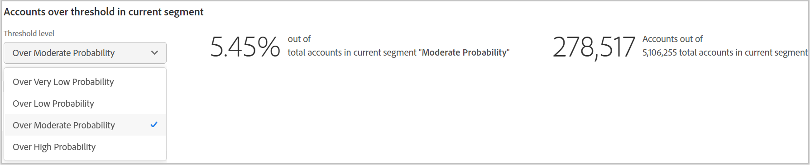

# Informes de cuentas compartidas {#shared-accounts-reports}

Los Informes de cuentas compartidas proporcionan otro grupo de gráficos y diagramas que reflejan el comportamiento de uso compartido y consumo para el segmento actual. Por ejemplo, **[!UICONTROL Over Moderate Probability]** y **[!UICONTROL Over Low Probability]** para el segmento actual.

## Probabilidad de compartir cuentas {#accounts-sharing-probability}

Este gráfico de anillo y barras muestra los porcentajes (y números absolutos) de las cuentas de suscriptor que se encuentran en rangos específicos de probabilidad de uso compartido. Estos intervalos se definen como:

* Muy alta (80%-100%)
* Alto (60-80%)
* Moderado (40 %-60 %)
* Baja (20%-40%)
* Muy bajo (0%-20%)

La línea roja marca el rango de umbral seleccionado en la [Cuentas por encima del umbral en el segmento actual](#threshold-selector) y el área roja clara contiene el total de todas las cuentas por encima de ese umbral.

El gráfico de barras representa el número de cuentas que se encuentran en cada rango en el eje Y para cada uno de los rangos (trazados en el eje X).

Una vez más, la línea roja marca el umbral actual y el área roja clara contiene el total de todas las cuentas por encima de ese umbral.

>[!NOTE]
>
> El eje Y del gráfico de barras es logarítmico.

### Cuentas por encima del umbral en el segmento actual{#threshold-selector}

Este panel le permite seleccionar el rango de umbral para los gráficos de anillo y de barras de arriba. Las cuatro opciones son:

* Cuentas **muy bajo** uso compartido **probabilidad**

* Cuentas **demasiado bajo** uso compartido **probabilidad**

* Cuentas **demasiado moderado** uso compartido **probabilidad**

* Cuentas **demasiado alto** uso compartido **probabilidad**

Una vez seleccionado el umbral, el panel muestra el porcentaje (y el número) de cuentas de todas las cuentas de suscriptor del segmento seleccionado.

## Solicitudes de reproducción de segmentos de un total {#play-request-out-total}

El gráfico de anillo muestra el porcentaje (y el número) de solicitudes de reproducción realizadas por los suscriptores del segmento y permite comparar las solicitudes de reproducción realizadas por suscriptores que no están en el segmento definido.

Cuando se mueve el cursor sobre el gráfico de anillo, también se muestran los porcentajes de suscriptores y los números de varios rangos de probabilidad.

<!---->

## Número promedio de dispositivos por cuenta según el segmento{#avg-devices-account}

El gráfico de barras muestra el número promedio de dispositivos de cada tipo que están actualmente en uso los suscriptores del segmento actual y de los que no lo están.

## Códigos postales de segmento por periodo y cuenta {#zip-codes-period-account}

Este gráfico le informa sobre el número de suscriptores del segmento actual que consumen contenido de diferentes ubicaciones (según las medidas por código postal) durante el intervalo de tiempo determinado.

>[!NOTE]
>
>Puede ampliar las barras que representan más de un conjunto de códigos postales, representados por un **+** (más) (por ejemplo, 10+), haciendo doble clic en ellos.

## Intervalo geográfico de segmentos por período por cuenta {#geo-span-period-account}

Este gráfico de barras representa el número de cuentas de suscriptor que consumen contenido de ubicaciones que se encuentran en diferentes rangos geográficos en millas. El rango se basa en la distancia máxima entre las ubicaciones desde las que un suscriptor ha transmitido en streaming durante el intervalo de tiempo.

>[!NOTE]
>
> Puede ampliar las barras que representan más de un conjunto de distancias geográficas, representadas con un **+** (más) (por ejemplo, 1000+), haciendo doble clic en ellos.

>[!MORELIKETHIS]
>
>* Obtenga información sobre cómo exportar informes para los 1000 suscriptores principales del segmento seleccionado mediante filtros en Informes de cuentas compartidas mediante [Exportar las 1000 cuentas principales](/help/accountiq/export-acc-information.md) opción.
