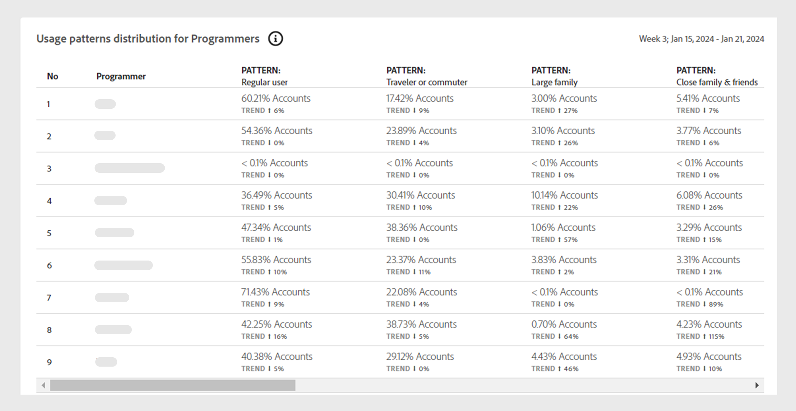

# Patrones de uso {#usage-patterns}

Account IQ clasifica a los usuarios de cuentas de suscriptor en varias categorías en términos de comportamiento social, como viajero o viajero habitual, familia numerosa y uso compartido de la comunidad. El **Patrones de uso** Esta página muestra varios análisis e informes diferentes para estas tipologías de usuario. Por ejemplo, **Distribución de patrones de uso** Los informes comparan el comportamiento de uso del segmento actual con el de todas sus cuentas.

Al igual que las demás páginas de la aplicación, los análisis e informes se basan en el segmento actual definido en la variable [panel de segmentos](/help/accountiq/segments-timeinterval.md).

## Distribución de patrones de uso {#usage-pattern-dis}

El gráfico de barras del clúster muestra el número y los porcentajes de suscriptores para cada comportamiento social o patrón de uso.

Servicios +++D2C: Patrones de uso distribution-Users en el segmento

El gráfico de barras del clúster siguiente compara la distribución del patrón de uso del segmento actual con un segmento que contenga todas las cuentas.

*Patrones de uso distribution-Users en el segmento*

+++

+++TV en todas partes: patrones de uso distribution-Users en segmentos vs. industria

Además de comparar cada patrón de uso en el segmento actual con todo el sector, también lo compara con un segmento que contiene todas las cuentas.

*Patrones de uso distribution-Users en el segmento frente al sector*

+++

## Distribución del patrón de uso en el segmento {#usage-pattern-dis-segment}

El **[!UICONTROL Usage patterns distribution in segment]** el panel tabula la siguiente información para cada patrón de usuario:

* Rango de probabilidad de uso compartido en el que se encuentran las cuentas individuales.
* Número y porcentaje de cuentas en ese patrón.
* Total y porcentaje de uso por parte de los suscriptores de esa categoría en términos de solicitudes de juego.

*Distribución de patrones de uso en el segmento*

Por ejemplo, en la visualización anterior:

* Un usuario normal (de una a pocas personas con un número limitado de dispositivos en una sola ubicación) en el segmento definido tiene una probabilidad de uso compartido de cuenta de entre el 5 y el 13 %.

* El 70,2% (376.615) del total de cuentas de suscriptores (536.640) son usuarios habituales.

* El 44,5% (2.896.346) del total de solicitudes de juego (6.512.593) son hechas por usuarios regulares.

## Distribución del patrón de uso para categorías de vídeo {#usage-pattern-dis-video-categories}

Servicios +++D2C: Distribución del patrón de uso para regiones

El **[!UICONTROL Usage pattern distribution]** proporciona una comparación de patrones de uso entre [categorías de vídeo](product-concepts.md##video-category-def) en el segmento actual.

*Distribución de patrones de uso para regiones*

>[!NOTE]
>
>La categoría de vídeo mostrada en la imagen anterior, como **Regiones** es solo un ejemplo. Al iniciar sesión en Account IQ, la etiqueta muestra las categorías de vídeo específicas de la empresa.

+++

+++Programador: Distribución del patrón de uso para MVPD

El **[!UICONTROL Usage pattern distribution]** proporciona una comparación de la distribución del patrón de uso para las MVPD del segmento actual.

*Distribución de patrones de uso para programadores*

+++

+++MVPD: Distribución del patrón de uso para programadores

El **[!UICONTROL Usage pattern distribution]** proporciona una comparación de la distribución del patrón de uso para los programadores o canales del segmento actual.

*Distribución de patrones de uso para MVPD*

+++
