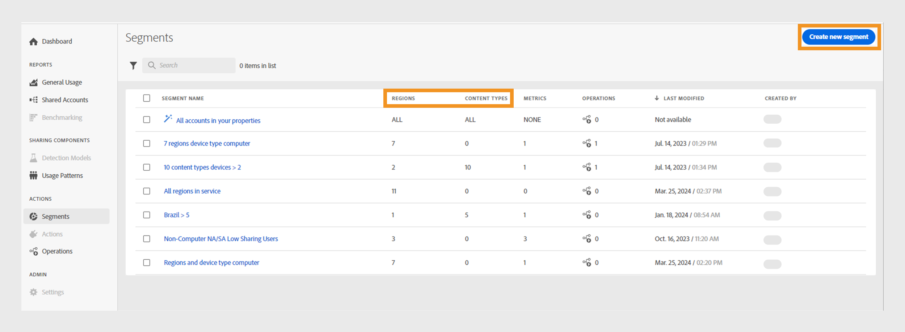

# Trabajo con segmentos {#work-with-segments}

[Segments](product-concepts.md#segmet-def) es una colección de cuentas de suscriptores que le permiten analizar el uso compartido de credenciales en condiciones definidas por el usuario. Puede utilizar segmentos para examinar diferentes conjuntos de cuentas de suscriptor y generar los informes de datos correspondientes en tablas y gráficos. Existen dos tipos de segmentos en Account IQ:

1. **Segmento predeterminado**: **Todas las cuentas de sus propiedades** es un segmento predeterminado en el sistema que incluye todas las cuentas de suscriptor activas sin las condiciones específicas aplicadas.

   >[!NOTE]
   >
   >El uso del segmento predeterminado puede impedir la visualización de ciertas tablas como las [categorías de vídeo en el segmento](data-panels.md#video-categories-segment), la [puntuación de uso compartido por canales y MVPD](data-panels.md#sharin-score-by-channels-and-mvpds) y la [distribución del patrón de uso para categorías de vídeo](usage-patterns.md#usage-pattern-dis-video-categories). Estas tablas solo pueden admitir y mostrar datos de hasta 20 filas a la vez. El resto de tablas, gráficos e informes son los mismos para los segmentos predeterminados y personalizados.

1. **Segmentos personalizados**: Se trata de segmentos personalizados que permiten agrupar cuentas de suscriptor de categorías específicas, como tipos de contenido D2C, programadores, canales y MVPD para analizar el uso compartido de credenciales en condiciones definidas por el usuario. Más información sobre cómo [crear un segmento personalizado](#create-new-segment).

   >[!IMPORTANT]
   >
   >Todos los procedimientos descritos en esta guía se basan en segmentos personalizados. Sin embargo, los conceptos siguen siendo los mismos para los segmentos predeterminados y personalizados.

Cuando vaya a **Actions** y seleccione la pestaña **[!UICONTROL Segments]** en el panel izquierdo, se mostrará una lista de los segmentos disponibles en el sistema. La página de segmentos le permite evaluar rápidamente los detalles clave sobre cada segmento en formato de tabla. Los detalles incluyen el nombre del segmento, el número de [categorías de vídeo](product-concepts.md#video-category-def), métricas, [operaciones](product-concepts.md#operation-def) con el segmento actual, la última fecha y hora de modificación, así como el nombre del creador del segmento.

Puede realizar las siguientes funciones con segmentos:

* [Crear un nuevo segmento](#create-new-segment)
* [Administración de segmentos](#manage-segments)

## Crear un nuevo segmento {#create-new-segment}

El proceso de creación de un nuevo segmento es similar para los servicios D2C y TV en todas partes. Las categorías de vídeo serán diferentes para cada versión respectiva de Account IQ.

+++Servicios D2C

Para generar un segmento y analizar el comportamiento compartido del suscriptor, seleccione **[!UICONTROL Create new segment]** en la esquina superior derecha.

*Seleccione Crear nuevo segmento*

>[!NOTE]
>
>Las categorías de vídeo mostradas en la imagen anterior, como **Regiones** y **Tipos de contenido** son solo ejemplos. Al iniciar sesión en Account IQ, estas etiquetas muestran las categorías de vídeo específicas de la empresa.

Abre una página **Nuevo segmento**, que incluye los siguientes elementos:

*Nueva página de segmento*

**A.** Componentes de segmento **B.** Definición de segmento **C.** Resumen de segmento

* **Componentes de segmento**: inventario de [categorías de vídeo](product-concepts.md##video-category-def) y métricas calculadas utilizadas para definir un segmento.

  >[!NOTE]
  >
  >Use **[!UICONTROL Show all]** para expandir la lista de componentes del segmento. Para encontrar un componente rápidamente, busque su nombre en **buscar componentes de segmento** en lugar de desplazarse por toda la lista.

* **Definición de segmento**: Un lienzo en el que puede arrastrar y soltar varios componentes de segmento para generar un segmento.

* **Resumen de segmentos**: Un resumen que estima las cuentas calificadas en función de los componentes de la definición del segmento y proporciona una breve descripción general del segmento durante el período de evaluación.

Siga estos pasos para crear un segmento:

1. Escriba el nombre del segmento en **Nombre del segmento** que será visible en la lista de segmentos y durante la selección del segmento.
1. Escriba una descripción detallada de su segmento en **Descripción del segmento**.
1. Por ejemplo, arrastre **Regiones y tipos de contenido** desde los componentes del segmento en el panel izquierdo y suéltelos en la sección **Regiones/Tipos de contenido** dentro de la **definición del segmento**.

   >[!NOTE]
   >
   >Puede crear un segmento basado en regiones o tipos de contenido. Ver los tipos de contenido asociados de una región desde un menú desplegable.

   Si empieza agregando un **tipo de contenido** en la sección **Regiones/Tipos de contenido**, solo podrá agregar tipos de contenido como componentes subsiguientes.

   Si comienza agregando una **Región** en la sección **Regiones/Tipos de contenido**, aparecerá un cuadro de diálogo de decisión.

   {width="550" align="left"}

   *Agregar componente de segmento como área o cuadro de diálogo de tipos de contenido*

   Decida si desea comparar regiones específicas o un segmento en función de los tipos de contenido asociados a una región.

   Seleccione **[!UICONTROL As a region]** para agregar regiones a la sección **Regiones/Tipos de contenido**.

   Seleccione **[!UICONTROL As its content types]** para agregar tipos de contenido de una región.

1. Arrastre **Métricas** desde los componentes del segmento en el panel izquierdo y suéltelas en la sección **Métricas** dentro de la **definición del segmento**.

   

   *Seleccione un operador y asigne un valor para la métrica agregada*

   Después de agregar métricas en la definición del segmento, elija un operador en el menú desplegable **[!UICONTROL Select an operator]** y asigne un valor mediante **[!UICONTROL Select an option]**.

   Ajuste los valores de determinadas métricas utilizando la flecha hacia arriba para aumentar y la flecha hacia abajo para disminuir.

1. Arrastre **Métricas calculadas** desde los componentes del segmento en el panel izquierdo y suéltelas en la sección **Métricas calculadas** dentro de la **definición del segmento**.

   

   *Seleccione un operador y asigne un valor para la métrica calculada agregada*

   Después de agregar métricas calculadas en la definición del segmento, **[!UICONTROL Select an operator]** del menú desplegable y asigne un valor mediante **[!UICONTROL Select an option]**.

   >[!NOTE]
   >
   >Todas las métricas y métricas calculadas que suelte en la definición del segmento irán acompañadas de los operadores adecuados para asignar valores a las métricas y métricas calculadas correspondientes.

1. Revise los detalles del segmento en **Resumen del segmento** para decidir los cambios que desea implementar en todo el segmento.
1. Seleccione **[!UICONTROL Last week]** o **[!UICONTROL Last month]** del menú desplegable **Período de evaluación** para estimar los valores de resumen de la semana o el mes pasados.
1. Seleccione **[!UICONTROL Update estimation]** para calcular el número de cuentas calificadas estimadas en el segmento actual basándose en el período de evaluación seleccionado.
1. Seleccione **[!UICONTROL Save segment]**.

El segmento que ha creado ya está disponible en la lista de segmentos.

+++

+++TV en todas partes

Para generar un segmento y analizar el comportamiento compartido del suscriptor, seleccione **[!UICONTROL Create new segment]** en la esquina superior derecha.

*Seleccione Crear nuevo segmento*

Abre una página **Nuevo segmento**, que incluye los siguientes elementos:

*Nueva página de segmento*

**A.** Componentes de segmento **B.** Definición de segmento **C.** Resumen de segmento

* **Componentes de segmento**: inventario de programadores y canales, MVPD, métricas y métricas calculadas utilizadas para definir un segmento.

  >[!NOTE]
  >
  >Use **[!UICONTROL Show all]** para expandir la lista de componentes del segmento. Para encontrar un componente rápidamente, busque su nombre en **buscar componentes de segmento** en lugar de desplazarse por toda la lista.

* **Definición de segmento**: Un lienzo en el que puede arrastrar y soltar varios componentes de segmento para generar un segmento.

* **Resumen de segmentos**: Un resumen que estima las cuentas calificadas en función de los componentes de la definición del segmento y proporciona una breve descripción general del segmento durante el período de evaluación.

Siga estos pasos para crear un segmento:

1. Escriba el nombre del segmento en **Nombre del segmento** que será visible en la lista de segmentos y durante la selección del segmento.
1. Escriba una descripción detallada de su segmento en **Descripción del segmento**.
1. Arrastre **Programadores y canales** desde los componentes del segmento en el panel izquierdo y suéltelos en la sección **Programadores/canales** dentro de la **definición del segmento**.

   >[!NOTE]
   >
   >Puede crear un segmento basado en programadores o canales. Vea los canales asociados con un programador desde un menú desplegable.

   Si empieza agregando un **Canal** en la sección **Programadores/Canales**, solo podrá agregar canales como componentes subsiguientes.

   Si empieza agregando un **Programador** en la sección **Programadores/Canales**, aparecerá un cuadro de diálogo de decisión.

   {width="550" align="left"}

   *Agregar componente de segmento como programador o su cuadro de diálogo de canales*

   Decida si desea comparar programadores específicos o un segmento basado en los canales asociados a un programador.

   Seleccione **[!UICONTROL As a programmer]** para agregar programadores a la sección **Programadores/Canales**.

   Seleccione **[!UICONTROL As its channels]** para agregar todos los canales de un programador.

1. Arrastre **MVPD** desde los componentes del segmento en el panel izquierdo y suéltelos en la sección **MVPD** dentro de la **definición del segmento**.

   >[!NOTE]
   >
   >Cuando inicia sesión como programador, aparece una MVPD denominada **xfinity** como una opción independiente en la sección **MVPD**. No se puede combinar con ningún otro MVPD.

1. Arrastre **Métricas** desde los componentes del segmento en el panel izquierdo y suéltelas en la sección **Métricas** dentro de la **definición del segmento**.

   

   *Seleccione un operador y asigne un valor para la métrica agregada*

   Después de agregar métricas en la definición del segmento, elija un operador en el menú desplegable **[!UICONTROL Select an operator]** y asigne un valor mediante **[!UICONTROL Select an option]**.

   Ajuste los valores de determinadas métricas utilizando la flecha hacia arriba para aumentar y la flecha hacia abajo para disminuir.

1. Arrastre **Métricas calculadas** desde los componentes del segmento en el panel izquierdo y suéltelas en la sección **Métricas calculadas** dentro de la **definición del segmento**.

   

   *Seleccione un operador y asigne un valor para la métrica calculada agregada*

   Después de agregar métricas calculadas en la definición del segmento, **[!UICONTROL Select an operator]** del menú desplegable y asigne un valor mediante **[!UICONTROL Select an option]**.

   >[!NOTE]
   >
   >Todas las métricas y métricas calculadas que suelte en la definición del segmento irán acompañadas de los operadores adecuados para asignar valores a las métricas y métricas calculadas correspondientes.

1. Revise los detalles del segmento en **Resumen del segmento** para decidir los cambios que desea implementar en todo el segmento.
1. Seleccione **[!UICONTROL Last week]** o **[!UICONTROL Last month]** del menú desplegable **Período de evaluación** para estimar los valores de resumen de la semana o el mes pasados.
1. Seleccione **[!UICONTROL Update estimation]** para calcular el número de cuentas calificadas estimadas en el segmento actual basándose en el período de evaluación seleccionado.
1. Seleccione **[!UICONTROL Save segment]**.

El segmento que ha creado ya está disponible en la lista de segmentos.
+++

## Administración de segmentos {#manage-segments}

Puede seleccionar un segmento de la lista de segmentos y, a continuación, realizar las siguientes acciones:

* [Edición de segmentos](#edit-segment)
* [Duplicación de segmentos](#duplicate-segment)
* [Eliminar un segmento](#delete-segment)

*Seleccione un segmento para editar, duplicar o eliminar*

**A.** [Segmento predeterminado](#work-with-segments) **B.** [Categorías de vídeo](product-concepts.md#video-category-def)

>[!NOTE]
>
>Las categorías de vídeo que se muestran en esta sección, como **MVPD**, **Programadores** y **Canales**, representan las etiquetas utilizadas en la versión de TV Everywhere de Account IQ. Si ha iniciado sesión como servicio D2C, estas etiquetas muestran las categorías de vídeo específicas de su empresa.

No puede editar, duplicar ni eliminar el segmento predeterminado denominado **Todas las cuentas de sus propiedades**.

### Edición de segmentos {#edit-segment}

1. Vaya a la pestaña **[!UICONTROL Segments]** en **Acciones** en el panel izquierdo para ver una lista de segmentos.
1. Seleccione el segmento que desee editar.
1. Seleccione **[!UICONTROL Edit]**.
1. Modifique los detalles del segmento, como el nombre del segmento, la descripción o los componentes de la **definición del segmento**.

   >[!TIP]
   >
   >Use **[!UICONTROL Clear all]** para eliminar todos los componentes de segmento dentro de cada sección bajo definición de segmento a la vez. También puede seleccionar el botón cruzado para eliminar elementos individuales.

   

   *Seleccione Borrar todo para quitar todos los componentes del segmento a la vez*

1. Seleccione **[!UICONTROL Update segment]** para actualizar el segmento existente o **[!UICONTROL Save as new segment]** para crear un nuevo segmento con los cambios.

   >[!NOTE]
   >
   >No se permite actualizar segmentos que estén en funcionamiento en este momento. Guardar cambios como un nuevo segmento es la única opción para segmentos con operaciones en curso.

### Duplicación de segmentos {#duplicate-segment}

1. Vaya a la pestaña **[!UICONTROL Segments]** en **Acciones** en el panel izquierdo para ver una lista de segmentos.
1. Seleccione el segmento que desee duplicar.
1. Seleccione **[!UICONTROL Duplicate]**.

Se genera una copia del segmento seleccionado y se coloca al final de la lista de segmentos. Puede editar los detalles necesarios en el segmento duplicado y, a continuación, actualizar el segmento duplicado o guardarlo como un nuevo segmento.

### Eliminar un segmento {#delete-segment}

1. Vaya a la pestaña **[!UICONTROL Segments]** en **Acciones** en el panel izquierdo para ver una lista de segmentos.
1. Seleccione el segmento que desee eliminar.

   Seleccione varios segmentos para eliminarlos en una sola operación. También puede seleccionar una casilla de verificación a la izquierda de **Nombre del segmento** para eliminar todos los segmentos a la vez.

   >[!NOTE]
   >
   > Solo puede eliminar más de un segmento o todos los segmentos si ninguna de las operaciones utiliza ninguno. Además, no se permite eliminar el segmento predeterminado denominado **Todas las cuentas de las propiedades**. Permanecerá sin seleccionar cuando intente eliminar todos los segmentos a la vez.

   

   *Seleccione varios segmentos para eliminar más de uno*

1. Seleccione **[!UICONTROL Delete]**.
1. Confirme a **[!UICONTROL Delete]** en el cuadro de diálogo para quitar el segmento de forma permanente.

   >[!NOTE]
   >
   >El segmento se elimina permanentemente del sistema y no se puede deshacer esta acción.
