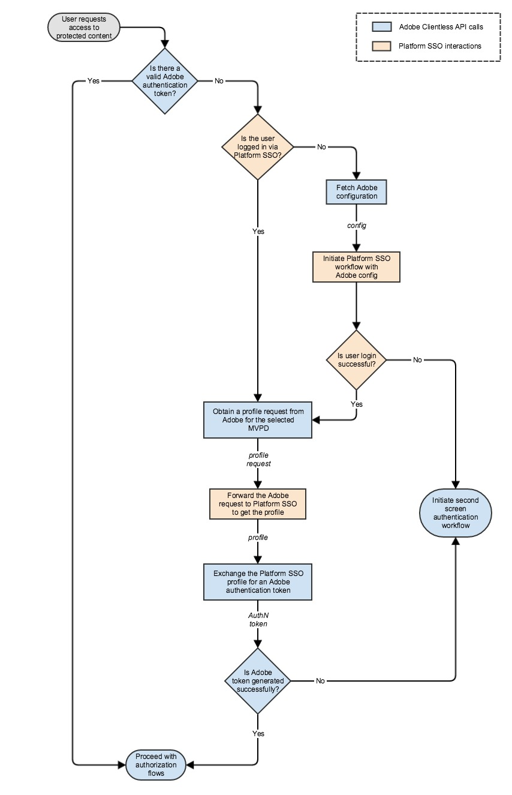

# Guía de Apple SSO (heredada) (API de REST V1) {#apple-sso-cookbook-rest-api-v1}

>[!IMPORTANT]
>
>El contenido de esta página se proporciona únicamente con fines informativos. El uso de esta API requiere una licencia actual de Adobe. No se permite el uso no autorizado.

La API de REST de autenticación de Adobe Pass V1 es compatible con el inicio de sesión único (SSO) de socio para usuarios finales de aplicaciones cliente que se ejecutan en iOS, iPadOS o tvOS.

Este documento actúa como una extensión de la documentación de la API V1 de REST existente, que se puede encontrar [aquí](/help/authentication/integration-guide-programmers/legacy/rest-api-v1/rest-api-reference.md).

## Guía {#apple-sso-cookbook-rest-api-v1-cookbook}

Para beneficiarse de la experiencia del usuario de SSO de Apple, la aplicación necesita integrar el [Marco de cuenta del suscriptor de vídeo](https://developer.apple.com/documentation/videosubscriberaccount) desarrollado por Apple, mientras que para la comunicación de la API de REST de autenticación de Adobe Pass V1, debe seguir la secuencia de pasos que se presentan a continuación.

### Permiso {#apple-sso-cookbook-rest-api-v1-permission}

>[!TIP]
>
> **<u>Sugerencia profesional:</u>** La aplicación de transmisión debe solicitar acceso a la información de suscripción del usuario guardada en el nivel de dispositivo, para lo cual el usuario debe dar permiso a la aplicación para continuar, de forma similar a proporcionar acceso a la cámara o al micrófono del dispositivo. Se debe solicitar este permiso por aplicación utilizando el [marco de trabajo de cuenta de suscriptor de vídeo](https://developer.apple.com/documentation/videosubscriberaccount) de Apple, y el dispositivo guardará la selección del usuario.

>[!TIP]
>
> **<u>Consejo profesional:</u>** Recomendamos incentivar a los usuarios que se nieguen a dar permiso para acceder a la información de la suscripción explicando los beneficios de la experiencia del usuario de inicio único de sesión de Apple, pero tenga en cuenta que el usuario puede cambiar su decisión yendo a la configuración de la aplicación (acceso de permiso del proveedor de TV) o a *`Settings -> TV Provider`* en iOS y iPadOS o a *`Settings -> Accounts -> TV Provider`* en tvOS.

>[!TIP]
>
> **<u>Sugerencia profesional:</u>** Se recomienda solicitar el permiso del usuario cuando la aplicación entre en el estado en primer plano, ya que la aplicación puede comprobar el permiso de [acceso](https://developer.apple.com/documentation/videosubscriberaccount/vsaccountmanager/1949763-checkaccessstatus) a la información de suscripción del usuario en cualquier momento antes de requerir la autenticación del usuario.

### Autenticación {#apple-sso-cookbook-rest-api-v1-authentication}

* [¿Hay un token de autenticación de Adobe válido?](#step1)
* [¿El usuario ha iniciado sesión mediante SSO de socio?](#step2)
* [Recuperar configuración de Adobe](#step3)
* [Iniciar flujo de trabajo de SSO de socio con configuración de Adobe](#step4)
* [¿El usuario ha iniciado sesión correctamente?](#step5)
* [Obtener una solicitud de perfil del Adobe para el MVPD seleccionado](#step6)
* [Reenviar la solicitud de Adobe al SSO del socio para obtener el perfil](#step7)
* [Intercambio del perfil SSO del socio por un token de autenticación de Adobe](#step8)
* [¿Se ha generado correctamente el token de Adobe?](#step9)
* [Iniciar flujo de trabajo de autenticación regular](#step10)
* [Continuar con flujos de autorización](#step11)



#### Paso: &quot;¿Hay un token de autenticación de Adobe válido?&quot; {#step1}

>[!TIP]
>
> **<u>Sugerencia:</u>** Implemente esto a través del medio del servicio de API de autenticación de Adobe Pass [Comprobar testigo de autenticación](/help/authentication/integration-guide-programmers/legacy/rest-api-v1/apis/check-authentication-token.md).

#### Paso: &quot;¿El usuario ha iniciado sesión mediante SSO de socio?&quot; {#step2}

>[!TIP]
>
> **<u>Sugerencia:</u>** Implemente esto a través del [Marco de cuenta de suscriptor de vídeo](https://developer.apple.com/documentation/videosubscriberaccount).

* La aplicación tendría que comprobar si tiene [permiso para acceder](https://developer.apple.com/documentation/videosubscriberaccount/vsaccountmanager/1949763-checkaccessstatus) a la información de suscripción del usuario y continuar solo si el usuario lo permite.
* La aplicación tendría que enviar una [solicitud](https://developer.apple.com/documentation/videosubscriberaccount/vsaccountmetadatarequest) para obtener información de la cuenta del suscriptor.
* La aplicación tendría que esperar y procesar la información de [metadata](https://developer.apple.com/documentation/videosubscriberaccount/vsaccountmetadata).

>[!TIP]
>
> **<u>Sugerencia profesional:</u>** Siga el fragmento de código y preste especial atención a los comentarios.

```swift
...
let videoSubscriberAccountManager: VSAccountManager = VSAccountManager();

videoSubscriberAccountManager.checkAccessStatus(options: [VSCheckAccessOption.prompt: true]) { (accessStatus, error) -> Void in
            switch (accessStatus) {
            // The user allows the application to access subscription information.
            case VSAccountAccessStatus.granted:
                    // Construct the request for subscriber account information.
                    let vsaMetadataRequest: VSAccountMetadataRequest = VSAccountMetadataRequest();

                    // This is actually the SAML Issuer not the channel ID.
                    vsaMetadataRequest.channelIdentifier = "https://saml.sp.auth.adobe.com";
    
                    // This is the subscription account information needed at this step.
                    vsaMetadataRequest.includeAccountProviderIdentifier = true;
                    
                    // This is the subscription account information needed at this step.
                    vsaMetadataRequest.includeAuthenticationExpirationDate = true;
                    
                    // This is going to make the Video Subscriber Account Framework to refrain from prompting the user with the providers picker at this step. 
                    vsaMetadataRequest.isInterruptionAllowed = false;
                    
                    // Submit the request for subscriber account information - accountProviderIdentifier.
                    videoSubscriberAccountManager.enqueue(vsaMetadataRequest) { vsaMetadata, vsaError in        
                        if (vsaMetadata != nil && vsaMetadata!.accountProviderIdentifier != nil) {
                            // The vsaMetadata!.authenticationExpirationDate will contain the expiration date for current authentication session.
                            // The vsaMetadata!.authenticationExpirationDate should be compared against current date.
                            ...
                            // The vsaMetadata!.accountProviderIdentifier will contain the provider identifier as it is known for the platform configuration.
                            // The vsaMetadata!.accountProviderIdentifier represents the platformMappingId in terms of Adobe Pass Authentication configuration.
                            ...
                            // The application must determine the MVPD id property value based on the platformMappingId property value obtained above.
                            // The application must use the MVPD id further in its communication with Adobe Pass Authentication services.
                            ...
                            // Continue with the "Obtain a profile request from Adobe for the selected MVPD" step.
                            ...
                            // Continue with the "Forward the Adobe request to Partner SSO to obtain the profile" step.
                            ...
                        } else {
                            // The user is not authenticated at platform level, continue with the "Fetch Adobe configuration" step.
                            ...
                        }
                    }
        
            // The user has not yet made a choice or does not allow the application to access subscription information.
            default:
                // Continue with the "Initiate regular authentication workflow" step.
                ...
            }
}
...  
```

#### Paso: &quot;Recuperar configuración de Adobe&quot; {#step3}

>[!TIP]
>
> **<u>Sugerencia:</u>** Implemente esto a través del medio de autenticación de Adobe Pass [Proporcione el servicio de API MVPD List](/help/authentication/integration-guide-programmers/legacy/rest-api-v1/apis/provide-mvpd-list.md).

>[!TIP]
>
> **<u>Sugerencia profesional:</u>** Tenga en cuenta las propiedades de MVPD: *`enablePlatformServices`*, *`boardingStatus`*, *`displayInPlatformPicker`*, *`platformMappingId`*, *`requiredMetadataFields`* y preste especial atención a los comentarios presentados en fragmentos de código de otros pasos.

#### Paso &quot;Iniciar flujo de trabajo de SSO de socio con configuración de Adobe&quot; {#step4}

>[!TIP]
>
> **<u>Sugerencia:</u>** Implemente esto a través del [Marco de cuenta de suscriptor de vídeo](https://developer.apple.com/documentation/videosubscriberaccount).

* La aplicación tendría que comprobar si tiene [permiso para acceder](https://developer.apple.com/documentation/videosubscriberaccount/vsaccountmanager/1949763-checkaccessstatus) a la información de suscripción del usuario y continuar solo si el usuario lo permite.
* La aplicación tendría que proporcionar un [delegado](https://developer.apple.com/documentation/videosubscriberaccount/vsaccountmanagerdelegate) para VSAccountManager.
* La aplicación tendría que enviar una [solicitud](https://developer.apple.com/documentation/videosubscriberaccount/vsaccountmetadatarequest) para obtener información de la cuenta del suscriptor.
* La aplicación tendría que esperar y procesar la información de [metadata](https://developer.apple.com/documentation/videosubscriberaccount/vsaccountmetadata).

>[!TIP]
>
> **<u>Sugerencia profesional:</u>** Siga el fragmento de código y preste especial atención a los comentarios.

```swift
    ...
    let videoSubscriberAccountManager: VSAccountManager = VSAccountManager();
    
    // This must be a class implementing the VSAccountManagerDelegate protocol.
    let videoSubscriberAccountManagerDelegate: VideoSubscriberAccountManagerDelegate = VideoSubscriberAccountManagerDelegate();
    
    videoSubscriberAccountManager.delegate = videoSubscriberAccountManagerDelegate;
    
    videoSubscriberAccountManager.checkAccessStatus(options: [VSCheckAccessOption.prompt: true]) { (accessStatus, error) -> Void in
                switch (accessStatus) {
                // The user allows the application to access subscription information.
                case VSAccountAccessStatus.granted:
                        // Construct the request for subscriber account information.
                        let vsaMetadataRequest: VSAccountMetadataRequest = VSAccountMetadataRequest();
    
                        // This is actually the SAML Issuer not the channel ID.
                        vsaMetadataRequest.channelIdentifier = "https://saml.sp.auth.adobe.com";
        
                        // This is the subscription account information needed at this step.
                        vsaMetadataRequest.includeAccountProviderIdentifier = true;
                        
                        // This is the subscription account information needed at this step.
                        vsaMetadataRequest.includeAuthenticationExpirationDate = true;
                        
                        // This is going to make the Video Subscriber Account Framework to prompt the user with the providers picker at this step. 
                        vsaMetadataRequest.isInterruptionAllowed = true;
                        
                        // This can be computed from the [Adobe Pass Authentication](/help/authentication/provide-mvpd-list.md) service response in order to filter the TV providers from the Apple picker.
                        vsaMetadataRequest.supportedAccountProviderIdentifiers = supportedAccountProviderIdentifiers;
    
                        // This can be computed from the [Adobe Pass Authentication](/help/authentication/provide-mvpd-list.md) service response in order to sort the TV providers from the Apple picker.
                        if #available(iOS 11.0, tvOS 11, *) {
                            vsaMetadataRequest.featuredAccountProviderIdentifiers = featuredAccountProviderIdentifiers;
                        }
                        
                        // Submit the request for subscriber account information - accountProviderIdentifier.
                        videoSubscriberAccountManager.enqueue(vsaMetadataRequest) { vsaMetadata, vsaError in                        
                            // This represents the checks for the "Is user login successful?" step.
                            if (vsaMetadata != nil && vsaMetadata!.accountProviderIdentifier != nil) {
                                // The vsaMetadata!.authenticationExpirationDate will contain the expiration date for current authentication session.
                                // The vsaMetadata!.authenticationExpirationDate should be compared against current date.
                                ...
                                // The vsaMetadata!.accountProviderIdentifier will contain the provider identifier as it is known for the platform configuration.
                                // The vsaMetadata!.accountProviderIdentifier represents the platformMappingId in terms of Adobe Pass Authentication configuration.
                                ...
                                // The application must determine the MVPD id property value based on the platformMappingId property value obtained above.
                                // The application must use the MVPD id further in its communication with Adobe Pass Authentication services.
                                ...
                                // Continue with the "Obtain a profile request from Adobe for the selected MVPD" step.
                                ...
                                // Continue with the "Forward the Adobe request to Partner SSO to obtain the profile" step.
                                ...
                            } else {
                                // The user is not authenticated at platform level.
                                if (vsaError != nil) {
                                    // The application can check to see if the user selected a provider which is present in Apple picker, but the provider is not onboarded in platform SSO.
                                    if let error: NSError = (vsaError! as NSError), error.code == 1, let appleMsoId = error.userInfo["VSErrorInfoKeyUnsupportedProviderIdentifier"] as! String? {
                                        var mvpd: Mvpd? = nil;
    
                                        // The requestor.mvpds must be computed during the "Fetch Adobe configuration" step. 
                                        for provider in requestor.mvpds {
                                            if provider.platformMappingId == appleMsoId {
                                                mvpd = provider;
                                                break;
                                            }
                                        }
                                        
                                        if mvpd != nil {
                                            // Continue with the "Initiate regular authentication workflow" step, but you can skip prompting the user with your MVPD picker and use the mvpd selection, therefore creating a better UX.
                                            ...
                                        } else {
                                            // Continue with the "Initiate regular authentication workflow" step.
                                            ...
                                        }
                                    } else {
                                        // Continue with the "Initiate regular authentication workflow" step.
                                        ...
                                    }
                                } else {
                                    // Continue with the "Initiate regular authentication workflow" step.
                                    ...
                                }
                            }
                        }
            
                // The user has not yet made a choice or does not allow the application to access subscription information.
                default:
                    // Continue with the "Initiate regular authentication workflow" step.
                    ...
                }
    }
    ...
```

#### Paso: &quot;¿El inicio de sesión del usuario se ha realizado correctamente?&quot; {#step5}

>[!TIP]
>
> **<u>Sugerencia profesional:</u>** Tenga en cuenta el fragmento de código del paso [&quot;Iniciar flujo de trabajo de SSO de socio con configuración de Adobe&quot;](#step4). El inicio de sesión del usuario se realiza correctamente en el caso de que *`vsaMetadata!.accountProviderIdentifier`* contenga un valor válido y la fecha actual no haya pasado el valor *`vsaMetadata!.authenticationExpirationDate`*.

#### Paso &quot;Obtener una solicitud de perfil del Adobe para la MVPD seleccionada&quot; {#step6}

>[!TIP]
>
> **<u>Sugerencia:</u>** Implemente esto a través del servicio de API de autenticación de Adobe Pass [Solicitud de perfil](/help/authentication/integration-guide-programmers/legacy/rest-api-v1/apis/retrieve-profilerequest.md).

>[!TIP]
>
> **<u>Sugerencia profesional:</u>** Tenga en cuenta que el identificador de proveedor obtenido del marco de trabajo de cuenta de suscriptor de vídeo representa a *`platformMappingId`* en términos de la configuración de autenticación de Adobe Pass. Por lo tanto, la aplicación debe determinar el valor de la propiedad MVPD id, usando el valor *`platformMappingId`*, a través del medio del servicio de API Adobe Pass Authentication [Proporcionar lista de MVPD](/help/authentication/integration-guide-programmers/legacy/rest-api-v1/apis/provide-mvpd-list.md).

#### Paso: &quot;Reenviar la solicitud de Adobe al SSO del socio para obtener el perfil&quot; {#step7}

>[!TIP]
>
> **<u>Sugerencia:</u>** Implemente esto a través del [Marco de cuenta de suscriptor de vídeo](https://developer.apple.com/documentation/videosubscriberaccount).


* La aplicación tendría que comprobar si tiene [permiso para acceder](https://developer.apple.com/documentation/videosubscriberaccount/vsaccountmanager/1949763-checkaccessstatus) a la información de suscripción del usuario y continuar solo si el usuario lo permite.
* La aplicación tendría que enviar una [solicitud](https://developer.apple.com/documentation/videosubscriberaccount/vsaccountmetadatarequest) para obtener información de la cuenta del suscriptor.
* La aplicación tendría que esperar y procesar la información de [metadata](https://developer.apple.com/documentation/videosubscriberaccount/vsaccountmetadata).

>[!TIP]
>
> **<u>Sugerencia profesional:</u>** Siga el fragmento de código y preste especial atención a los comentarios.

```swift
    ...
    let videoSubscriberAccountManager: VSAccountManager = VSAccountManager();
    
    videoSubscriberAccountManager.checkAccessStatus(options: [VSCheckAccessOption.prompt: true]) { (accessStatus, error) -> Void in
                switch (accessStatus) {
                // The user allows the application to access subscription information.
                case VSAccountAccessStatus.granted:
                        // Construct the request for subscriber account information.
                        let vsaMetadataRequest: VSAccountMetadataRequest = VSAccountMetadataRequest();
    
                        // This is actually the SAML Issuer not the channel ID.
                        vsaMetadataRequest.channelIdentifier = "https://saml.sp.auth.adobe.com";
        
                        // This is going to include subscription account information which should match the provider determined in a previous step.
                        vsaMetadataRequest.includeAccountProviderIdentifier = true;
                        
                        // This is going to include subscription account information which should match the provider determined in a previous step.
                        vsaMetadataRequest.includeAuthenticationExpirationDate = true;
                        
                        // This is going to make the Video Subscriber Account Framework to refrain from prompting the user with the providers picker at this step. 
                        vsaMetadataRequest.isInterruptionAllowed = false;
    
                        // This are the user metadata fields expected to be available on a successful login and are determined from the [Adobe Pass Authentication](/help/authentication/provide-mvpd-list.md) service. Look for the requiredMetadataFields associated with the provider determined in a previous step.
                        vsaMetadataRequest.attributeNames = requiredMetadataFields;
    
                        // This is the payload from [Adobe Pass Authentication](/help/authentication/retrieve-profilerequest.md) service.
                        vsaMetadataRequest.verificationToken = profileRequestPayload;
                        
                        // Submit the request for subscriber account information.
                        videoSubscriberAccountManager.enqueue(vsaMetadataRequest) { vsaMetadata, vsaError in
                            if (vsaMetadata != nil && vsaMetadata!.samlAttributeQueryResponse != nil) {
                                var samlResponse: String? = vsaMetadata!.samlAttributeQueryResponse!;
                                
                                // Remove new lines, new tabs and spaces.
                                samlResponse = samlResponse?.replacingOccurrences(of: "[ \\t]+", with: " ", options: String.CompareOptions.regularExpression);
                                samlResponse = samlResponse?.components(separatedBy: CharacterSet.newlines).joined(separator: "");
                                samlResponse = samlResponse?.trimmingCharacters(in: CharacterSet.whitespacesAndNewlines);
                                
                                // Base64 encode.
                                samlResponse = samlResponse?.data(using: .utf8)?.base64EncodedString(options: []);
                                
                                // URL encode. Please be aware not to double URL encode it further.
                                samlResponse = samlResponse?.addingPercentEncoding(withAllowedCharacters: CharacterSet.init(charactersIn: "!*'();:@&=+$,/?%#[]").inverted);
                                
                                // Continue with the "Exchange the Partner SSO profile for an Adobe authentication token" step.
                                ...
                            } else {
                                // Continue with the "Initiate regular authentication workflow" step.
                                ...
                            }
                        }
                        
                // The user has not yet made a choice or does not allow the application to access subscription information.
                default:
                    // Continue with the "Initiate regular authentication workflow" step.
                    ...
                }
    }
    ...
```

#### Paso: &quot;Intercambio del perfil SSO del socio por un token de autenticación de Adobe&quot; {#step8}

>[!TIP]
>
> **<u>Sugerencia:</u>** Implemente esto a través del servicio de API de autenticación de Adobe Pass [Intercambio de tokens](/help/authentication/integration-guide-programmers/legacy/rest-api-v1/apis/token-exchange.md).

>[!TIP]
>
> **<u>Sugerencia profesional:</u>** Tenga en cuenta el fragmento de código del [&quot;Reenviar la solicitud de Adobe al SSO del socio para obtener el paso del perfil&quot;](#step7). Este(a) *`vsaMetadata!.samlAttributeQueryResponse!`* representa el(la) *`SAMLResponse`*, que debe pasarse en [Intercambio de tokens](/help/authentication/integration-guide-programmers/legacy/rest-api-v1/apis/token-exchange.md) y requiere manipulación de cadenas y codificación (*Codificado(a) Base64* y codificado(a) *URL* posteriormente) antes de realizar la llamada.

#### Paso: &quot;¿El token de Adobe se ha generado correctamente?&quot; {#step9}

>[!TIP]
>
> **<u>Sugerencia:</u>** Implemente esto a través del medio de la respuesta correcta de autenticación de Adobe Pass [Intercambio de tokens](/help/authentication/integration-guide-programmers/legacy/rest-api-v1/apis/token-exchange.md), que será una respuesta correcta de *`204 No Content`*, lo que indica que el token se creó correctamente y está listo para utilizarse en los flujos de autorización.

#### Paso: &quot;Iniciar flujo de trabajo de autenticación regular&quot; {#step10}

>[!TIP]
>
> **<u>Sugerencia:</u>** Implemente esto a través del medio de la autenticación de Adobe Pass [Solicitud de código de registro](/help/authentication/integration-guide-programmers/legacy/rest-api-v1/apis/registration-code-request.md), [Iniciar autenticación](/help/authentication/integration-guide-programmers/legacy/rest-api-v1/apis/initiate-authentication.md) y [Recuperar token de autenticación](/help/authentication/integration-guide-programmers/legacy/rest-api-v1/apis/retrieve-authentication-token.md) o [Comprobar token de autenticación](/help/authentication/integration-guide-programmers/legacy/rest-api-v1/apis/check-authentication-token.md) servicios de API.

>[!TIP]
>
> **<u>Sugerencia profesional:</u>** Siga los pasos descritos a continuación para las implementaciones de tvOS.

* La aplicación tendría que [obtener un código de registro](/help/authentication/integration-guide-programmers/legacy/rest-api-v1/apis/registration-code-request.md) y presentarlo al usuario final en el primer dispositivo (pantalla).
* La aplicación tendría que iniciar [sondeo para confirmar el estado de autenticación](/help/authentication/integration-guide-programmers/legacy/rest-api-v1/apis/retrieve-authentication-token.md) en el primer dispositivo (pantalla) después de obtener el código de registro.
* Otra aplicación tendría que [iniciar autenticación](/help/authentication/integration-guide-programmers/legacy/rest-api-v1/apis/initiate-authentication.md) en un segundo dispositivo (pantalla) cuando se use el código de registro.
* La aplicación tendría que detener [el sondeo](/help/authentication/integration-guide-programmers/legacy/rest-api-v1/apis/retrieve-authentication-token.md) en el primer dispositivo (pantalla) cuando se genere el token de autenticación.

>[!TIP]
>
> **<u>Sugerencia profesional:</u>** Siga los pasos descritos a continuación para las implementaciones de iOS/iPadOS.

* La aplicación tendría que [obtener un código de registro](/help/authentication/integration-guide-programmers/legacy/rest-api-v1/apis/registration-code-request.md) que no debería presentarse al usuario final en el primer dispositivo (pantalla).
* La aplicación tendría que [iniciar la autenticación](/help/authentication/integration-guide-programmers/legacy/rest-api-v1/apis/initiate-authentication.md) en el primer dispositivo (pantalla) usando el código de registro y un componente [WKWebView](https://developer.apple.com/documentation/webkit/wkwebview) o [SFSafariViewController](https://developer.apple.com/documentation/safariservices/sfsafariviewcontroller).
* La aplicación tendría que iniciar [sondeo para conocer el estado de autenticación](/help/authentication/integration-guide-programmers/legacy/rest-api-v1/apis/retrieve-authentication-token.md) en el primer dispositivo (pantalla) después de que se cierre [WKWebView](https://developer.apple.com/documentation/webkit/wkwebview) o el componente [SFSafariViewController](https://developer.apple.com/documentation/safariservices/sfsafariviewcontroller).
* La aplicación tendría que detener [el sondeo](/help/authentication/integration-guide-programmers/legacy/rest-api-v1/apis/retrieve-authentication-token.md) en el primer dispositivo (pantalla) cuando se genere el token de autenticación.

#### Paso: &quot;Continuar con los flujos de autorización&quot; {#step11}

>[!TIP]
>
> **<u>Sugerencia:</u>** Implemente esto a través del medio de autenticación de Adobe Pass [Iniciar autorización](/help/authentication/integration-guide-programmers/legacy/rest-api-v1/apis/initiate-authorization.md) y [Obtener token de medios corto](/help/authentication/integration-guide-programmers/legacy/rest-api-v1/apis/obtain-short-media-token.md) servicios de API.

### Cerrar sesión {#apple-sso-cookbook-rest-api-v1-logout}

El [marco de cuenta de suscriptor de vídeo](https://developer.apple.com/documentation/videosubscriberaccount) no proporciona una API para cerrar la sesión mediante programación de las personas que han iniciado sesión en su cuenta de proveedor de TV en el nivel de sistema del dispositivo. Por lo tanto, para que el cierre de sesión surta efecto, el usuario final tendría que cerrar sesión explícitamente desde *`Settings -> TV Provider`* en iOS/iPadOS o *`Settings -> Accounts -> TV Provider`* en tvOS. La otra opción que tendría el usuario es retirar el permiso para acceder a la información de suscripción del usuario desde la sección de configuración específica de la aplicación (acceso al proveedor de TV).

>[!TIP]
>
> **<u>Sugerencia:</u>** Implemente esto a través del medio de la autenticación de Adobe Pass [Llamada de metadatos de usuario](/help/authentication/integration-guide-programmers/legacy/rest-api-v1/apis/user-metadata.md) y los servicios de API [Cerrar sesión](/help/authentication/integration-guide-programmers/legacy/rest-api-v1/apis/initiate-logout.md).

>[!TIP]
>
> **<u>Sugerencia profesional:</u>** Siga los pasos descritos a continuación para las implementaciones de tvOS.

* La aplicación tendría que determinar si la autenticación se ha producido como resultado de un inicio de sesión a través del SSO del socio o no, utilizando los &quot;*tokenSource&quot;* [metadatos de usuario](/help/authentication/integration-guide-programmers/legacy/rest-api-v1/apis/user-metadata.md) del servicio de autenticación de Adobe Pass.
* La aplicación tendría que indicar o pedir al usuario que cierre sesión explícitamente desde *`Settings -> Accounts -> TV Provider`* en tvOS **solo** en caso de que el valor *&quot;tokenSource&quot;* sea igual a &quot;*Apple&quot;.*
* La aplicación tendría que [iniciar el cierre de sesión](/help/authentication/integration-guide-programmers/legacy/rest-api-v1/apis/initiate-logout.md) desde el servicio de autenticación de Adobe Pass usando una llamada HTTP directa. Esto no facilitaría la limpieza de la sesión en el lado de MVPD.

>[!TIP]
>
> **<u>Sugerencia profesional:</u>** Siga los pasos descritos a continuación para las implementaciones de iOS/iPadOS.

* La aplicación tendría que determinar si la autenticación se ha producido como resultado de un inicio de sesión a través del SSO del socio o no, utilizando los &quot;*tokenSource&quot;* [metadatos de usuario](/help/authentication/integration-guide-programmers/legacy/rest-api-v1/apis/user-metadata.md) del servicio de autenticación de Adobe Pass.
* La aplicación tendría que indicar o pedir al usuario que cierre sesión explícitamente desde *`Settings -> TV Provider`* en iOS/iPadOS **solo** en caso de que el valor *&quot;tokenSource&quot;* sea igual a *&quot;Apple&quot;*.
* La aplicación tendría que [iniciar el cierre de sesión](/help/authentication/integration-guide-programmers/legacy/rest-api-v1/apis/initiate-logout.md) desde el servicio de autenticación de Adobe Pass usando un [WKWebView](https://developer.apple.com/documentation/webkit/wkwebview) o un componente [SFSafariViewController](https://developer.apple.com/documentation/safariservices/sfsafariviewcontroller). Esto facilitaría la limpieza de la sesión en el lado de MVPD.
