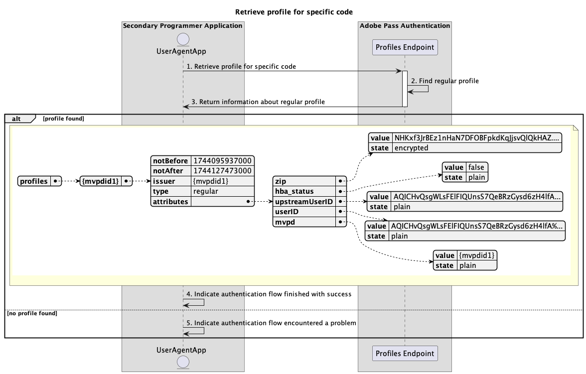

# Flujo de perfiles básicos realizado en la aplicación secundaria {#basic-profiles-flow-secondary-application}

>[!IMPORTANT]
>
> El contenido de esta página se proporciona únicamente con fines informativos. El uso de esta API requiere una licencia actual de Adobe. No se permite el uso no autorizado.

>[!IMPORTANT]
>
> La implementación de la API REST V2 está limitada por la documentación de [Mecanismo de limitación](/help/authentication/integration-guide-programmers/throttling-mechanism.md).

>[!MORELIKETHIS]
>
> Asegúrese de visitar también las [Preguntas frecuentes sobre la API REST V2](/help/authentication/integration-guide-programmers/rest-apis/rest-api-v2/rest-api-v2-faqs.md#authentication-phase-faqs-general).

El **flujo de perfiles** dentro del derecho de autenticación de Adobe Pass permite que la aplicación secundaria acceda a la información sobre los inicios de sesión activos de los usuarios.

El flujo de perfiles básicos le permite consultar los siguientes escenarios:

* [Recuperar perfil para código específico](#retrieve-profile-for-specific-code)

## Recuperar perfil para código específico {#retrieve-profile-for-specific-code}

### Requisitos previos {#prerequisites-retrieve-profile-for-specific-code}

Antes de recuperar el perfil de un código de autenticación específico, asegúrese de que se cumplen los siguientes requisitos previos:

* La aplicación secundaria, que tiene un(a) `code` utilizado(a) para realizar la autenticación interactiva con MVPD, desea recuperar el perfil para un código de autenticación específico.

### Flujo de trabajo {#workflow-retrieve-profile-for-specific-code}

Siga los pasos dados para implementar el flujo básico de recuperación de perfiles para un código de autenticación específico realizado dentro de una aplicación secundaria, como se muestra en el diagrama siguiente.

*Recuperar perfil para código específico*

1. **Recuperar perfil para código específico:** La aplicación secundaria recopila todos los datos necesarios para recuperar información de perfil para ese código de autenticación específico enviando una solicitud al extremo de perfiles.

   >[!IMPORTANT]
   >
   > Consulte la documentación de la API [Recuperar perfil para código específico](../../apis/profiles-apis/rest-api-v2-profiles-apis-retrieve-profile-for-specific-code.md) para obtener detalles sobre:
   >
   > * Todos los _parámetros necesarios_, como `serviceProvider` y `code`
   > * Todos los _encabezados_ requeridos, como `Authorization`
   > * Todos los _parámetros y encabezados_ opcionales

1. **Buscar perfil normal:** El servidor de Adobe Pass identifica un perfil válido en función de los parámetros y encabezados recibidos.

1. **Devuelve información sobre el perfil normal:** La respuesta del extremo de perfiles contiene información sobre el perfil encontrado asociado a los parámetros y encabezados recibidos.

   >[!IMPORTANT]
   >
   > Consulte la documentación de la API [Recuperar perfil para código específico](../../apis/profiles-apis/rest-api-v2-profiles-apis-retrieve-profile-for-specific-code.md) para obtener detalles sobre la información proporcionada en una respuesta de perfil.
   > 
   >  
   > 
   > El extremo de perfiles valida los datos de solicitud para garantizar que se cumplan las condiciones básicas:
   >
   > * Los parámetros y encabezados _required_ deben ser válidos.
   >
   >  
   > 
   > Si la validación falla, se generará una respuesta de error, que proporcionará información adicional que se ajustará a la documentación de [Códigos de error mejorados](../../../../features-standard/error-reporting/enhanced-error-codes.md).

1. **Indique que el flujo de autenticación ha finalizado correctamente:** Si la respuesta del extremo de perfiles contiene un perfil, la aplicación secundaria procesa la respuesta y puede utilizarla para mostrar opcionalmente un mensaje específico en la interfaz de usuario.

1. **Indica que el flujo de autenticación encontró un problema:** Si la respuesta del extremo de perfiles no contiene un perfil, la aplicación secundaria procesa la respuesta y puede utilizarla para mostrar opcionalmente un mensaje específico en la interfaz de usuario.
