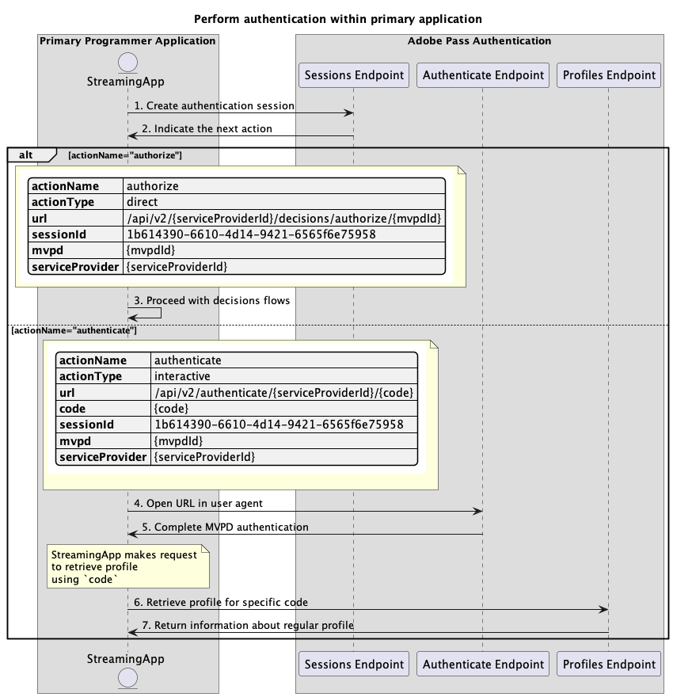

# Flujo de autenticación básico realizado en la aplicación principal {#basic-authentication-flow-performed-within-primary-application}

>[!IMPORTANT]
>
> El contenido de esta página se proporciona únicamente con fines informativos. El uso de esta API requiere una licencia actual de Adobe. No se permite el uso no autorizado.

>[!IMPORTANT]
>
> La implementación de la API REST V2 está limitada por la documentación de [Mecanismo de limitación](/help/authentication/throttling-mechanism.md).

El **flujo de autenticación** dentro del derecho de autenticación de Adobe Pass permite que la aplicación de transmisión verifique que un usuario tenga una cuenta de MVPD válida. Este proceso requiere que el usuario tenga una cuenta MVPD activa e introduzca credenciales de inicio de sesión válidas en la página de inicio de sesión de MVPD.

El flujo de autenticación es necesario en los siguientes casos:

* Cuando el usuario abre una aplicación por primera vez.
* Cuando la autenticación anterior del usuario ha caducado.
* Cuando el usuario cierra la sesión de la cuenta de MVPD.
* Cuando el usuario desea autenticarse con una MVPD diferente.

En todos estos casos, la aplicación que llama a cualquiera de los extremos de Profiles recibe una respuesta vacía para uno o más perfiles, pero para diferentes MVPD.

El **flujo de autenticación** requiere un agente de usuario (explorador) para completar una serie de llamadas desde la aplicación al servidor de Adobe Pass, luego a la página de inicio de sesión de MVPD y, finalmente, de nuevo a la aplicación. Este flujo puede incluir varias redirecciones a sistemas MVPD y la administración de cookies o sesiones almacenadas para cada dominio, lo que puede resultar difícil de lograr y proteger sin un agente de usuario.

En función de las capacidades de la aplicación principal (aplicación de streaming) para admitir la interacción del usuario para seleccionar una MVPD y autenticarse con la MVPD seleccionada en un agente de usuario, los escenarios de autenticación son los siguientes:

* [Realizar autenticación en la aplicación principal](./rest-api-v2-basic-authentication-primary-application-flow.md)
* [Realizar autenticación en la aplicación secundaria con mvpd preseleccionado](./rest-api-v2-basic-authentication-secondary-application-flow.md)
* [Realizar autenticación en la aplicación secundaria sin mvpd preseleccionado](./rest-api-v2-basic-authentication-secondary-application-flow.md)

## Realizar autenticación en la aplicación principal {#perform-authentication-within-primary-application}

### Requisitos previos {#prerequisites-perform-authentication-within-primary-application}

Antes de realizar la autenticación mediante la interacción del usuario dentro de una aplicación principal, asegúrese de que se cumplan los siguientes requisitos previos:

* La aplicación de streaming debe seleccionar una MVPD.
* La aplicación de streaming debe iniciar una sesión de autenticación para iniciar sesión con la MVPD seleccionada.
* La aplicación de streaming debe autenticarse con la MVPD seleccionada en un agente de usuario.

>[!IMPORTANT]
>
> Suposiciones
>
>  
> 
> * La aplicación de streaming admite la interacción del usuario para seleccionar una MVPD.
> * La aplicación de streaming admite la interacción del usuario para autenticarse con la MVPD seleccionada en un agente de usuario.

### Flujo de trabajo {#workflow-perform-authentication-completed-on-primary-application}

Siga los pasos dados para implementar el flujo de autenticación básico realizado dentro de una aplicación principal, como se muestra en el diagrama siguiente.

*Realizar autenticación en la aplicación principal*

1. **Crear sesión de autenticación:** La aplicación de flujo continuo recopila todos los datos necesarios para iniciar una sesión de autenticación llamando al extremo de sesiones.

   >[!IMPORTANT]
   >
   > Consulte la documentación de la API [Crear sesión de autenticación](../../apis/sessions-apis/rest-api-v2-sessions-apis-create-authentication-session.md) para obtener detalles sobre:
   > 
   > * Todos los parámetros _requeridos_, como `serviceProvider`, `mvpd`, `domainName` y `redirectUrl`
   > * Todos los _encabezados_ necesarios, como `Authorization`, `AP-Device-Identifier`
   > * Todos los _parámetros y encabezados_ opcionales
   > 
   >  
   > 
   > La aplicación de streaming debe proporcionar todos los parámetros necesarios en una sola llamada al crear la sesión de autenticación.

1. **Indique la siguiente acción:** La respuesta del extremo de sesiones contiene los datos necesarios para guiar a la aplicación de flujo continuo con respecto a la siguiente acción.

   >[!IMPORTANT]
   >
   > Consulte la documentación de la API [Crear sesión de autenticación](../../apis/sessions-apis/rest-api-v2-sessions-apis-create-authentication-session.md) para obtener más información sobre la información proporcionada en una respuesta de sesión.
   > 
   >  
   > 
   > El punto final de sesiones valida los datos de solicitud para garantizar que se cumplan las condiciones básicas:
   >
   > * Los parámetros y encabezados _required_ deben ser válidos.
   > * La integración entre `serviceProvider` y `mvpd` proporcionados debe estar activa.
   > 
   >  
   > 
   > Si la validación falla, se generará una respuesta de error, que proporcionará información adicional que se ajustará a la documentación de [Códigos de error mejorados](../../../enhanced-error-codes.md).

1. **Continuar con flujos de decisiones:** La respuesta del extremo de sesiones contiene los siguientes datos:
   * El atributo `actionName` está establecido en &quot;authorize&quot;.
   * El atributo `actionType` está establecido en &quot;direct&quot;.

   Si el servidor de Adobe Pass identifica un perfil válido, la aplicación de streaming no necesita volver a autenticarse con la MVPD seleccionada, ya que ya hay un perfil que se puede utilizar para flujos de decisiones posteriores.

1. **Abrir URL en el agente de usuario:** La respuesta del extremo de sesiones contiene los siguientes datos:
   * `url` que se puede usar para iniciar la autenticación interactiva en la página de inicio de sesión de MVPD.
   * El atributo `actionName` está establecido en &quot;autenticar&quot;.
   * El atributo `actionType` está establecido en &quot;interactivo&quot;.

   Si el backend de Adobe Pass no identifica un perfil válido, la aplicación de streaming abre un agente de usuario para cargar el `url` proporcionado, realizando una solicitud al extremo Authenticate. Este flujo puede incluir varias redirecciones, lo que finalmente lleva al usuario a la página de inicio de sesión de MVPD y proporciona credenciales válidas.

1. **Autenticación MVPD completa:** Si el flujo de autenticación es correcto, la interacción del agente de usuario guarda un perfil normal en el servidor de Adobe Pass y alcanza el valor de `redirectUrl` proporcionado.

1. **Recuperar perfil para código específico:** La aplicación de flujo continuo recopila todos los datos necesarios para recuperar información de perfil enviando una solicitud al extremo de perfiles.

   >[!IMPORTANT]
   >
   > Consulte la documentación de la API [Recuperar perfil para código específico](../../apis/profiles-apis/rest-api-v2-profiles-apis-retrieve-profile-for-specific-code.md) para obtener detalles sobre:
   >
   > * Todos los _parámetros necesarios_, como `serviceProvider`, `code`
   > * Todos los _encabezados_ necesarios, como `Authorization`, `AP-Device-Identifier`
   > * Todos los _parámetros y encabezados_ opcionales

   >[!NOTE]
   >
   > Sugerencia: la aplicación de streaming puede esperar a que el agente de usuario alcance el `redirectUrl` proporcionado para comprobar si el perfil normal se generó y guardó correctamente.

1. **Devuelve información sobre el perfil normal:** La respuesta del extremo de perfiles contiene información sobre el perfil normal asociado a los parámetros y encabezados recibidos.

   >[!IMPORTANT]
   >
   > Consulte la documentación de la API [Recuperar perfil para código específico](../../apis/profiles-apis/rest-api-v2-profiles-apis-retrieve-profile-for-specific-code.md) para obtener detalles sobre la información proporcionada en una respuesta de perfil.
   > 
   >  
   > 
   > El extremo de perfiles valida los datos de solicitud para garantizar que se cumplan las condiciones básicas:
   >
   > * Los parámetros y encabezados _required_ deben ser válidos.
   >
   >  
   > 
   > Si la validación falla, se generará una respuesta de error, que proporcionará información adicional que se ajustará a la documentación de [Códigos de error mejorados](../../../enhanced-error-codes.md).
