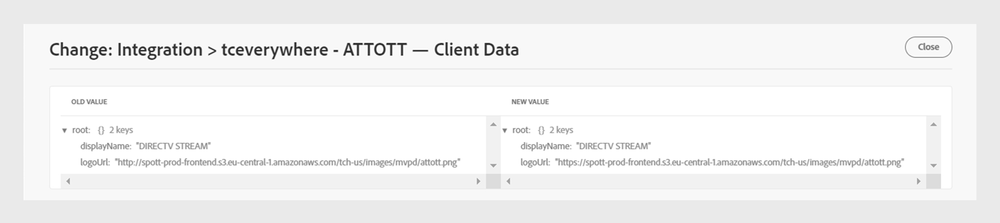

# Registro de cambios {#changes-log}

>[!NOTE]
>
>El contenido de esta página se proporciona únicamente con fines informativos. El uso de esta API requiere una licencia actual de Adobe. No se permite el uso no autorizado.

El **Registro de cambios** de TVE le permite ver los cambios de configuración insertados en el entorno de autenticación de Adobe Pass a través del panel de TVE. También puede comparar dos cambios de configuración diferentes.

El **Registro de cambios** La pestaña en el panel izquierdo muestra una lista de todos los cambios de configuración realizados a través de una cuenta específica del Tablero de TVE. Esta lista de cambios contiene los siguientes detalles:

* **Cambiar descripción**: Una breve descripción sobre el ámbito del cambio de configuración.
* **Empujado por**: ID de correo electrónico del usuario responsable de realizar el cambio.
* **Fecha push**: la fecha del cambio de configuración.
* **Estado push**: indica si la operación de inserción se realizó correctamente, está pendiente o ha fallado.

## Comparar cambios {#compare-changes}

Para comparar los cambios, siga estos pasos:

1. Seleccione dos cambios de configuración de la lista que desee comparar.

   

   *Comparar cambios de configuración*

1. Seleccionar **Comparar** en la esquina superior derecha de la pantalla.

   El **Cambios de configuración** Esta sección muestra el tipo de entidad, el ID de entidad, la propiedad y el estado de la operación de cambio para cada cambio.

1. Pase el ratón sobre el cambio de configuración que desee ver.
1. Seleccionar **Ver** para acceder a los valores modificados.

   

   *Ver cambios de configuración*

A continuación se muestra un ejemplo de un cambio realizado en la configuración seleccionada. Puede ver la diferencia entre los valores antiguos y los nuevos dentro del cambio.

*Valor antiguo y nuevo*

