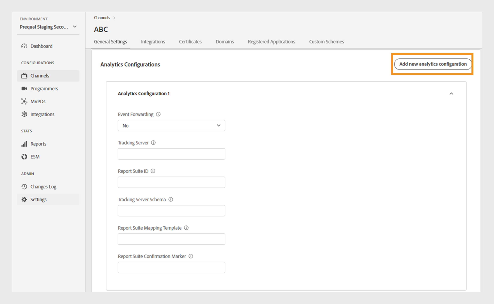

# Canales {#channels}

>[!NOTE]
>
>El contenido de esta página se proporciona únicamente con fines informativos. El uso de esta API requiere una licencia actual de Adobe. No se permite el uso no autorizado.

El **Canales** de TVE permite ver y gestionar la configuración de los canales asociados a un programador específico. También puede [añadir un canal nuevo](#add-new-channel) según sus necesidades.

El **Canales** La pestaña en el panel izquierdo muestra una lista de canales vinculados con los siguientes detalles:

* **Nombre para mostrar**: El nombre de marca del canal utilizado con fines comerciales.
* **ID de canal**: Un identificador único, también denominado ID de solicitante.
* **Integraciones**: el número de conexiones establecidas con [MVPD](/help/authentication/glossary.md#mvpd).

*Lista de canales existentes*

Escriba el nombre del canal en la **Buscar** sobre la lista para obtener más información sobre el canal.

## Administrar configuraciones de canal {#manage-channel-conf}

Siga los pasos para administrar varias configuraciones de un canal específico.

1. Seleccione el **Canales** en el panel izquierdo.
1. Seleccione el canal de la lista disponible.
1. Seleccione una de las siguientes pestañas para ver y editar la configuración correspondiente del canal seleccionado:

   * [Configuración general](#general-settings)
   * [Integraciones](#integrations)
   * [Certificados](#certificates)
   * [Domains](#domains)
   * [Aplicaciones registradas](#registered-applications)
   * [Esquemas personalizados](#custom-schemes)

   

   *Configuración de canal*

>[!IMPORTANT]
>
> Ver [Revisar y enviar cambios](/help/authentication/tve-dashboard-review-push-changes.md) para obtener más información sobre cómo activar los cambios de configuración.

### Configuración general {#general-settings}

Esta pestaña presenta **Información del canal** y **Configuración de Analytics**.

#### Información del canal {#channel-information}

En esta sección, puede editar los siguientes detalles:

* **Nombre para mostrar**: El nombre de marca del canal utilizado con fines comerciales.

* **URL de redirección predeterminada**: la URL de redireccionamiento de copia de seguridad para la autenticación y el cierre de sesión.

* **Informes de errores**: al seleccionar **Sí**, los SDK de Adobe Pass envían informes de errores al backend de Adobe Pass para Analytics.

*Editar información de canal*

#### Configuración de Analytics {#analytics-configuration}

Esta sección le permite configurar el reenvío de eventos de autenticación de Adobe Pass a Adobe Analytics.

Para habilitar **Configuración de Analytics**, póngase en contacto con el administrador técnico de cuentas (TAM) para obtener más información sobre la configuración del ID del grupo de informes (RSID).

*Habilitar configuraciones de Analytics*

Seleccionar **Añadir nueva configuración de análisis** para agregar varias configuraciones.

Se ha creado un nuevo cambio de configuración y está listo para la actualización del servidor. Para usar la nueva configuración de análisis desde el **Configuración de Analytics** , continúe con la sección [revisar y enviar cambios](/help/authentication/tve-dashboard-review-push-changes.md) Flujo.

### Integraciones {#integrations}

Esta pestaña muestra una lista de las integraciones disponibles entre el canal seleccionado actualmente y las MVPD. La lista presenta cada integración junto con su estado, indicando si está habilitada o no. Seleccione una integración específica de esta lista para acceder a información detallada en la [Integraciones](tve-dashboard-integrations.md) sección.

*Lista de integraciones disponibles*

### Certificados {#certificates}

Esta pestaña muestra una lista de [certificados disponibles](#available-certificates) y [certificados disponibles heredados](#inherited-avail-certificates) se utiliza en los flujos de cifrado de metadatos de usuario. Muestra detalles acerca de cada certificado, incluidos los siguientes:

* El estado (si está habilitado para **cifrado de metadatos de usuario** uso o no)
* Número de serie
* Nombre de la organización emisora
* Nombre de la organización a la que pertenece
* Fecha de emisión
* Fecha de caducidad
* Un menú desplegable para cifrar los metadatos del usuario (si selecciona **Sí**, el certificado cifra la información confidencial del usuario, como los valores del código postal).

#### Certificados disponibles {#available-certificates}

Estos certificados sirven como claves privadas o públicas y se utilizan para el cifrado de metadatos de usuarios.
Puede realizar los siguientes cambios en la sección certificados disponibles:

* [Añadir nuevo certificado](#add-new-certificate)
* [Eliminar certificado](#delete-certificate)

##### Añadir nuevo certificado {#add-new-certificate}

Para añadir un nuevo certificado, siga estos pasos:

1. Seleccionar **Añadir nuevo certificado** en la parte superior del **Certificados disponibles** sección.

   

   *Añadir un nuevo certificado*

1. Pegue la clave pública del certificado en la **Nuevo certificado** Cuadro de diálogo.
1. Seleccionar **Añadir certificado**.

   Se ha creado un nuevo cambio de configuración y está listo para la actualización del servidor. Para utilizar el nuevo certificado que aparece en la **Certificados disponibles** , continúe con la sección [revisar y enviar cambios](/help/authentication/tve-dashboard-review-push-changes.md) Flujo.

1. Busque el nuevo certificado en la lista de **Certificados disponibles**.

   >[!IMPORTANT]
   >
   > Asegúrese de que los sistemas estén actualizados y listos para utilizar el nuevo certificado.

1. Seleccionar **Sí** de **Se utiliza para cifrar los metadatos de usuario** menú desplegable para activar un nuevo certificado.

##### Eliminar certificado {#delete-certificate}

Siga estos pasos para eliminar un certificado.

1. Pase el ratón sobre el certificado que desea eliminar de la lista de **Certificados disponibles**.
1. Seleccionar **Eliminar**.

   

   *Quitar el certificado seleccionado*

1. Seleccionar **Eliminar** desde el **Eliminar certificado activo** Cuadro de diálogo.

Se ha creado un nuevo cambio de configuración y está listo para la actualización del servidor. El certificado se eliminará del **Certificados disponibles** solo después de [revisar y enviar cambios](/help/authentication/tve-dashboard-review-push-changes.md).

#### Certificados disponibles heredados {#inherited-avail-certificates}

Las empresas de medios definen estos certificados en su propio nivel. Todos los canales asociados con la misma empresa de medios pueden utilizar estos certificados.

*Certificados disponibles heredados*

### Domains {#domains}

Esta pestaña muestra una lista de los dominios disponibles a través de los cuales el canal respectivo se comunica con la autenticación de Adobe Pass.

Puede realizar los siguientes cambios en los dominios:

* [Añadir un nuevo dominio](#add-domains)
* [Eliminar dominio](#delete-domain)

>[!TIP]
>
> Evite agregar un nuevo subdominio si existe un dominio más general en la lista.

#### Añadir nuevo dominio {#add-domains}

Siga estos pasos para agregar un dominio.

1. Seleccionar **Añadir nuevo dominio** en la esquina superior derecha de la **Dominios disponibles** sección.

   

   *Añadir un nuevo dominio*

1. Escriba el nombre de su dominio en la **Nuevo dominio** Cuadro de diálogo.

1. Seleccionar **Añadir dominio** para añadir un nuevo dominio para el canal seleccionado.

Se ha creado un nuevo cambio de configuración y está listo para la actualización del servidor. Para utilizar el nuevo dominio que aparece en la **Dominios disponibles** , continúe con la sección [revisar y enviar cambios](/help/authentication/tve-dashboard-review-push-changes.md) Flujo.

#### Eliminar dominio {#delete-domain}

Siga estos pasos para eliminar un dominio.

1. Pase el ratón sobre el dominio que quiera eliminar de la lista de **Dominios disponibles**.
1. Seleccionar **Eliminar**.

   

   *Eliminar el dominio seleccionado*

1. Seleccionar **Eliminar** en el **Eliminar dominio** Cuadro de diálogo.

Se ha creado un nuevo cambio de configuración y está listo para la actualización del servidor. El dominio se eliminará del **Dominios disponibles** solo después de [revisar y enviar cambios](/help/authentication/tve-dashboard-review-push-changes.md).

El dominio seleccionado ya no está disponible para su uso. Como resultado, la aplicación asociada con este dominio pierde el acceso a los servicios de autenticación de Adobe Pass.

### Aplicaciones registradas {#registered-applications}

Esta pestaña proporciona una lista de los registros de aplicaciones. Ver [Dynamic client registration management](/help/authentication/dynamic-client-registration-management.md) para obtener más información.

### Esquemas personalizados {#custom-schemes}

Esta pestaña muestra una lista de esquemas personalizados. Ver [Registro de aplicaciones de iOS/tvOS](/help/authentication/iostvos-application-registration.md) y [Dynamic client registration management](/help/authentication/dynamic-client-registration-management.md) para obtener más información.

## Añadir nuevo canal {#add-new-channel}

Siga estos pasos para agregar un canal nuevo.

1. Seleccione el **Canales** en el panel izquierdo.
1. Seleccionar **Añadir nuevo canal** en la esquina superior derecha de la **Canales** sección.

   

   *Añadir un canal nuevo*

1. Seleccionar **ID de programador** en el menú desplegable de la **Nuevo canal** Cuadro de diálogo.

1. Escriba un identificador único en **ID de canal**.
1. Escriba el nombre de la marca del canal utilizado con fines comerciales en la **Nombre para mostrar**.
1. Seleccionar **Añadir canal**.

Se ha creado un nuevo cambio de configuración y está listo para la actualización del servidor. Para utilizar el nuevo canal enumerado en la **Canales** , continúe con la sección [revisar y enviar cambios](/help/authentication/tve-dashboard-review-push-changes.md) Flujo.

