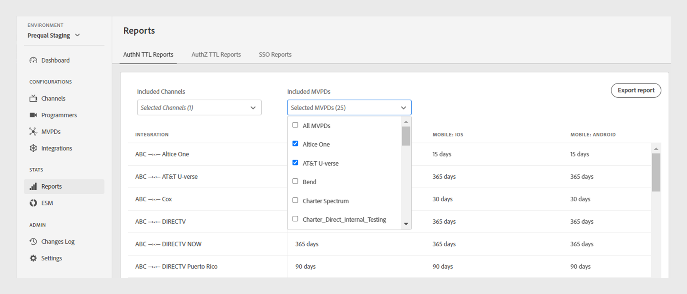

# Informes {#Reports}

>[!NOTE]
>
>El contenido de esta página se proporciona únicamente con fines informativos. El uso de esta API requiere una licencia actual de Adobe. No se permite el uso no autorizado.

El **Informes** de TVE proporciona acceso a los datos agregados para los informes AuthN TTL, AuthZ TTL y SSO. Estos informes incluyen las integraciones de su canal con diferentes MVPD en todos los [plataformas](#platforms).

Los informes le permiten filtrar datos y recopilar perspectivas en [Canales específicos o MVPD](#selecting-specific-channels-mvpds). También puede exportar informes en un archivo CSV para su análisis posterior.

## Ver informes {#view-reports}

Siga estos pasos para ver un informe específico.

1. Seleccione el **Informes** en el panel izquierdo.
1. Seleccione una de las siguientes pestañas para ver y exportar los datos agregados de los canales y MVPD incluidos:
   * [Informes TTL de AuthN](#authn-ttl-reports)
   * [Informes TTL de AuthZ](#authz-ttl-reports)
   * [Informes de SSO](#sso-reports)

   

   *Tipo de informes*

### Informes TTL de AuthN {#authn-ttl-reports}

Los informes TTL de AuthN, también conocidos como Tiempo de vida de autenticación (TTL), muestran la duración durante la cual se configuran los tokens de autenticación para sus integraciones de canales con varias MVPD en todos los canales [plataformas](#platforms). Estos informes le permiten inspeccionar la cantidad de tiempo que un usuario permanece autenticado para una MVPD y plataforma específicas. Los valores de duración se presentan en formatos prácticos como, **días**, **horas**, **minutos**, y **segundos**. La tabla Informes TTL de AuthN incluye un desplazamiento horizontal y vertical para acomodar diferentes tamaños de pantalla.

También puede ver y descargar datos de [canales específicos o MVPD](#selecting-specific-channels-mvpds).

*Exportar informes TTL de AuthN*

>[!IMPORTANT]
>
> El **Establecido por MVPD** El marcador de posición se utiliza cuando MVPD aplica el valor TTL AuthN en lugar de la configuración de autenticación de Adobe Pass.

Seleccionar **Exportación de informes** para guardar los datos como un archivo CSV en el equipo local.

### Informes TTL de AuthZ {#authz-ttl-reports}

Los informes TTL de AuthZ, también conocidos como Tiempo de vida de autorización (TTL), muestran la duración del token de autorización configurado para sus integraciones de canales con varias MVPD en todo [plataformas](#platforms). Estos informes le permiten inspeccionar la cantidad de tiempo que un usuario permanece autorizado para ver contenido de una MVPD y una plataforma específicas. Los valores de duración se presentan en formatos prácticos como, **días**, **horas**, **minutos**, y **segundos**. La tabla Informes TTL de AuthZ incluye desplazamiento horizontal y vertical para acomodar diferentes tamaños de pantalla.

También puede ver y descargar los datos de [canales específicos o MVPD](#selecting-specific-channels-mvpds).

*Exportar informes TTL de AuthZ*

>[!IMPORTANT]
>
> El **Establecido por MVPD** El marcador de posición se utiliza cuando MVPD aplica el valor TTL de AuthZ en lugar de la configuración de autenticación de Adobe Pass.

Seleccionar **Exportación de informes** para guardar los datos como un archivo CSV en el equipo local.

### Informes de SSO {#sso-reports}

Los informes SSO, también denominados de inicio de sesión único, muestran el estado de inicio de sesión único configurado para las integraciones de canales con varias MVPD en todos los dispositivos [plataformas](#platforms). Estos informes le permiten inspeccionar la experiencia de SSO de autenticación de usuario esperada para una plataforma y MVPD específicas. Los valores se presentan en formatos fáciles de usar, como **SSO deshabilitado**, **SSO activado**, y **SSO incierto**. La tabla Informes de SSO muestra el desplazamiento horizontal y vertical para acomodar diferentes tamaños de pantalla.

También puede ver y descargar datos de [canales específicos o MVPD](#selecting-specific-channels-mvpds).

*Exportar informes de SSO*

>[!IMPORTANT]
>
> El **SSO incierto** El marcador de posición indica que el inicio de sesión único (SSO) está habilitado y potencialmente operativo. Sin embargo, la configuración enumerada a continuación puede inhibir la autenticación SSO, como se explica en los siguientes ejemplos:
>
> * Configuración de la plataforma del usuario: la opción para bloquear las cookies de terceros.
> * Decisiones de usuario: Los usuarios deniegan el acceso a la plataforma a su suscripción de proveedor de TV.
> * Configuración de MVPD: MVPD solicita autenticación para cada canal.

Seleccionar **Exportación de informes** para guardar los datos como un archivo CSV en el equipo local.

## Plataformas {#platforms}

El [Informes TTL de AuthN](#authn-ttl-reports), [Informes TTL de AuthZ](#authz-ttl-reports), y [Informes de SSO](#sso-reports) presentar datos en varias plataformas, como:

* **Escritorio**: Muestra los valores aplicados a las implementaciones del programador mediante el SDK de JavaScript de autenticación de Adobe Pass.

* **Móvil**

  **iOS**: Muestra los valores aplicados mediante el SDK de Adobe Pass Authentication iOS.

  **Android**: Muestra los valores aplicados a través del SDK para Android de autenticación de Adobe Pass.

  **Otros**: Muestra los valores aplicados mediante la API de REST de autenticación de Adobe Pass desarrollada para dispositivos móviles.

* **TVCD**

  **Roku**: Muestra los valores aplicados a través de la API de REST de autenticación de Adobe Pass, identificando Roku como tipo de dispositivo.

  **FireTV**: Muestra los valores aplicados a través del SDK de Adobe Pass Authentication FireTV.

  **AppleTV**: Muestra los valores aplicados mediante el SDK para tvOS de autenticación de Adobe Pass.

  **Otros**: Muestra los valores aplicados mediante la API de REST de autenticación de Adobe Pass para dispositivos conectados a TV.

* **Plataforma no identificada**: Muestra los valores aplicados a las implementaciones del programador cuando los servicios de autenticación de Adobe Pass detectan un tipo de dispositivo desconocido.

Para obtener más información acerca de cómo compartir el tipo de dispositivo deseado, como **Roku** con las API de REST de autenticación de Adobe Pass o los SDK, vea el mecanismo de [pasar información del cliente](/help/authentication/passing-client-information-device-connection-and-application.md).

>[!IMPORTANT]
>
> Los datos agregados se basan en la configuración específica de cada entorno de autenticación de Adobe Pass. Cuando cambie entre diferentes entornos de TVE Dashboard, espere variaciones en los datos entre informes. Consulte la [Entornos de autenticación de Adobe Pass](/help/authentication/tve-dashboard-environments.md) para obtener más información.

## Selección de canales específicos y MVPD {#selecting-specific-channels-mvpds}

El [Informes TTL de AuthN](#authn-ttl-reports), [Informes TTL de AuthZ](#authz-ttl-reports), y [Informes de SSO](#sso-reports) presentar datos para **Todos los canales** integraciones con **Todas las MVPD** de forma predeterminada.

>[!NOTE]
>
> Si anula la selección **Todos los canales** o **Todas las MVPD** en los menús desplegables respectivos, se muestra un mensaje para realizar una selección y ver los informes significativos.

Para generar un informe para canales específicos:

1. Seleccione el **Canales incluidos** en la parte superior del informe seleccionado.

   

   *Menú desplegable Canales incluidos*

1. Anular selección **Todos los canales**.
1. Seleccione los canales necesarios en la **Canales incluidos** menú desplegable para el que desea generar datos.

>[!NOTE]
>
> Para tener opciones disponibles en **MVPD incluidos** menú desplegable, debe seleccionar al menos un canal en la **Canales incluidos** menú desplegable.

Para generar un informe para MVPD específicas:

1. Seleccione el **MVPD incluidos** en la parte superior del informe seleccionado.

   

   *Menú desplegable de MVPD incluidas*

1. Anular selección **Todas las MVPD**.
1. Seleccione las MVPD necesarias en la **MVPD incluidos** menú desplegable para el que desea generar datos.
