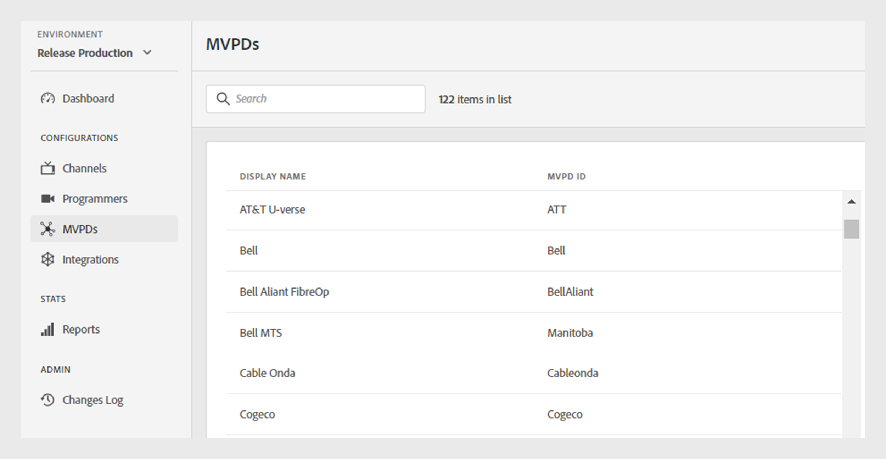

# MVPD

>[!NOTE]
>
>El contenido de esta página se proporciona únicamente con fines informativos. El uso de esta API requiere una licencia actual de Adobe. No se permite el uso no autorizado.

La sección **MVPD** del panel de TVE le permite ver una lista de las MVPD integradas en el ecosistema de autenticación de Adobe Pass.

La ficha **MVPD** del panel izquierdo muestra una lista de MVPD con los siguientes detalles:

* **Nombre para mostrar**: El nombre para mostrar en el selector de cada MVPD.

* **MVPD ID**: se usó un identificador único de MVPD para configurar una nueva integración en el sistema.

*Lista de MVPD integradas*

Escriba el nombre de un MVPD en la barra **Buscar** situada encima de la lista para buscar un MVPD específico.
