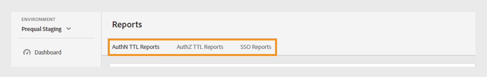
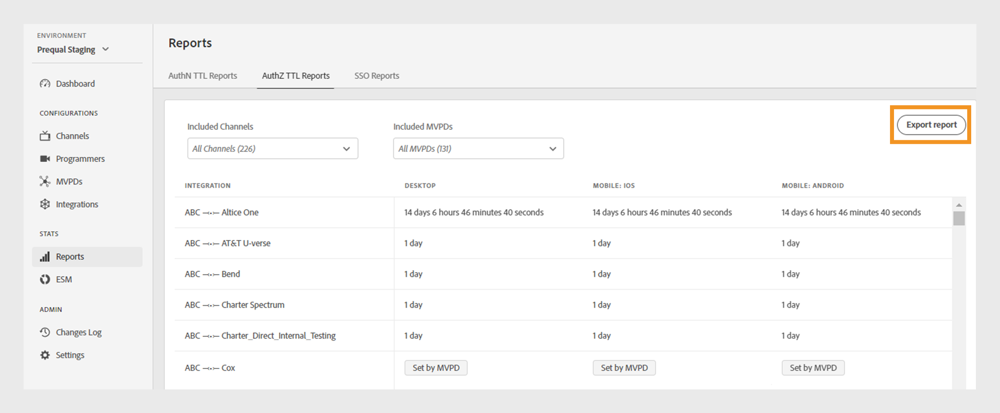

# Informes {#Reports}

>[!NOTE]
>
>El contenido de esta página se proporciona únicamente con fines informativos. El uso de esta API requiere una licencia actual de Adobe. No se permite el uso no autorizado.

La sección **Informes** del Tablero de TVE proporciona acceso a los datos agregados para los informes AuthN TTL, AuthZ TTL y SSO. Estos informes incluyen las integraciones de su canal con diferentes MVPD en todas las [plataformas](#platforms).

Los informes le permiten filtrar datos y recopilar datos en [canales o MVPD específicos](#selecting-specific-channels-mvpds). También puede exportar informes en un archivo CSV para su análisis posterior.

## Ver informes {#view-reports}

Siga estos pasos para ver un informe específico.

1. Seleccione la ficha **Informes** en el panel izquierdo.
1. Seleccione una de las siguientes pestañas para ver y exportar los datos agregados de los canales y MVPD incluidos:
   * [Informes TTL de AuthN](#authn-ttl-reports)
   * [Informes TTL de AuthZ](#authz-ttl-reports)
   * [Informes de SSO](#sso-reports)

   

   *Tipo de informes*

### Informes TTL de AuthN {#authn-ttl-reports}

Los informes TTL de AuthN, también denominados Tiempo de vida de autenticación (TTL), muestran la duración durante la cual se configuran los tokens de autenticación para sus integraciones de canales con varias MVPD en todas las [plataformas](#platforms). Estos informes le permiten inspeccionar el tiempo que un usuario permanece autenticado para una plataforma y MVPD específicos. Los valores de duración se presentan en formatos descriptivos, como **days**, **hours**, **minutes** y **seconds**. La tabla Informes TTL de AuthN incluye un desplazamiento horizontal y vertical para acomodar diferentes tamaños de pantalla.

También puede ver y descargar datos de [canales específicos o MVPD](#selecting-specific-channels-mvpds).

*Exportar informes TTL de autenticación*

>[!IMPORTANT]
>
> El marcador de posición **Set by MVPD** se usa cuando MVPD aplica el valor TTL AuthN en lugar de la configuración de autenticación de Adobe Pass.

Seleccione **Exportar informes** para guardar los datos como un archivo CSV en el equipo local.

### Informes TTL de AuthZ {#authz-ttl-reports}

Los informes TTL de AuthZ, también conocidos como Tiempo de vida de autorización (TTL), muestran la duración del token de autorización configurado para sus integraciones de canales con varias MVPD en todas las [plataformas](#platforms). Estos informes le permiten inspeccionar la cantidad de tiempo que un usuario permanece autorizado para ver contenido de una plataforma y un MVPD específicos. Los valores de duración se presentan en formatos descriptivos, como **days**, **hours**, **minutes** y **seconds**. La tabla Informes TTL de AuthZ incluye desplazamiento horizontal y vertical para acomodar diferentes tamaños de pantalla.

También puede ver y descargar los datos de [canales específicos o MVPD](#selecting-specific-channels-mvpds).

*Exportar informes TTL de AuthZ*

>[!IMPORTANT]
>
> El marcador de posición **Set by MVPD** se usa cuando MVPD aplica el valor TTL de AuthZ en lugar de la configuración de autenticación de Adobe Pass.

Seleccione **Exportar informes** para guardar los datos como un archivo CSV en el equipo local.

### Informes de SSO {#sso-reports}

Los informes SSO, también denominados inicio de sesión único, muestran el estado de inicio de sesión único configurado para las integraciones de canales con varias MVPD en todas las [plataformas](#platforms). Estos informes le permiten inspeccionar la experiencia de SSO de autenticación de usuario esperada para una MVPD y plataforma específicas. Los valores se presentan en formatos descriptivos, como **SSO deshabilitado**, **SSO habilitado** y **SSO incierto**. La tabla Informes de SSO muestra el desplazamiento horizontal y vertical para acomodar diferentes tamaños de pantalla.

También puede ver y descargar datos de [canales específicos o MVPD](#selecting-specific-channels-mvpds).

*Exportar informes de SSO*

>[!IMPORTANT]
>
> El marcador de posición **SSO incierto** indica que el inicio de sesión único (SSO) está habilitado y potencialmente operativo. Sin embargo, la configuración enumerada a continuación puede inhibir la autenticación SSO, como se explica en los siguientes ejemplos:
>
> * Configuración de la plataforma del usuario: la opción para bloquear las cookies de terceros.
> * Decisiones de usuario: Los usuarios deniegan el acceso a la plataforma a su suscripción de proveedor de TV.
> * Configuración de MVPD: MVPD solicita autenticación para cada canal.

Seleccione **Exportar informes** para guardar los datos como un archivo CSV en el equipo local.

## Plataformas {#platforms}

Los [Informes TTL de AuthN](#authn-ttl-reports), [Informes TTL de AuthZ](#authz-ttl-reports) y [Informes SSO](#sso-reports) presentan datos en varias plataformas, como:

* **Escritorio**: Muestra los valores aplicados a las implementaciones del programador a través de Adobe Pass Authentication JavaScript SDK.

* **Móvil**

  **iOS**: muestra los valores aplicados usando la autenticación de Adobe Pass en iOS SDK.

  **Android**: muestra los valores aplicados a través de la autenticación de Adobe Pass en Android SDK.

  **Otros**: Muestra los valores aplicados mediante la API de REST de autenticación de Adobe Pass desarrollada para dispositivos móviles.

* **TVCD**

  **Roku**: Muestra los valores aplicados a través de la API de REST de autenticación de Adobe Pass, identificando Roku como un tipo de dispositivo.

  **FireTV**: muestra los valores aplicados a través de Adobe Pass Authentication FireTV SDK.

  **AppleTV**: Muestra los valores aplicados mediante la autenticación de Adobe Pass en tvOS SDK.

  **Otros**: Muestra los valores aplicados usando la API de REST de autenticación de Adobe Pass para dispositivos conectados a TV.

* **Plataforma no identificada**: muestra los valores aplicados a las implementaciones del programador cuando los servicios de autenticación de Adobe Pass detectan un tipo de dispositivo desconocido.

Para obtener más información sobre cómo compartir el tipo de dispositivo deseado, como **Roku** con las API de REST de autenticación de Adobe Pass o los SDK, vea el mecanismo de [pasar información de clientes](/help/authentication/integration-guide-programmers/legacy/client-information/passing-client-information-device-connection-and-application.md).

>[!IMPORTANT]
>
> Los datos agregados se basan en la configuración específica de cada entorno de autenticación de Adobe Pass. Cuando cambie entre diferentes entornos de TVE Dashboard, espere variaciones en los datos entre informes. Consulte [Entornos de autenticación de Adobe Pass](/help/authentication/user-guide-tve-dashboard/tve-dashboard-environments.md) para obtener más información.

## Selección de canales específicos y MVPD {#selecting-specific-channels-mvpds}

Los [informes TTL de AuthN](#authn-ttl-reports), [informes TTL de AuthZ](#authz-ttl-reports) y [informes SSO](#sso-reports) presentan datos para **Todas las integraciones de canales** con **Todas las MVPD** de forma predeterminada.

>[!NOTE]
>
> Si anula la selección de **Todos los canales** o **Todas las MVPD** en los menús desplegables respectivos, aparece un mensaje para realizar una selección y ver los informes significativos.

Para generar un informe para canales específicos:

1. Seleccione el menú desplegable **Canales incluidos** en la parte superior del informe seleccionado.

   

   *Menú desplegable de canales incluidos*

1. Anular la selección de **Todos los canales**.

1. Seleccione los canales necesarios en el menú desplegable **Canales incluidos** para los que desee generar datos.

>[!NOTE]
>
> Para tener opciones disponibles en el menú desplegable **MVPD incluidas**, debe seleccionar al menos un canal en el menú desplegable **Canales incluidos**.

Para generar un informe para MVPD específicas:

1. Seleccione el menú desplegable **MVPD incluidas** en la parte superior del informe seleccionado.

   

   *Menú desplegable de MVPD incluidas*

1. Anule la selección de **Todas las MVPD**.

1. Seleccione las MVPD necesarias en el menú desplegable **MVPD incluidas** para las que desee generar datos.
