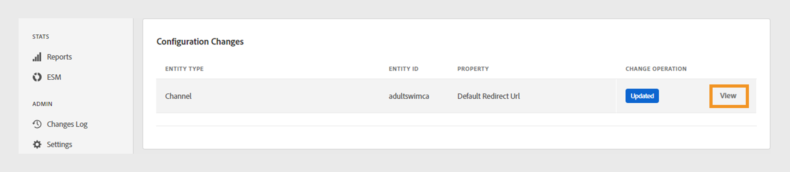

# Revisar y enviar cambios

>[!NOTE]
>
>El contenido de esta página se proporciona únicamente con fines informativos. El uso de esta API requiere una licencia actual de Adobe. No se permite el uso no autorizado.

El panel de TVE permite revisar los cambios realizados en la configuración actual e implementarlos en el servidor. Cada vez que modifique la configuración actual, aparecerá una notificación en la pantalla que le pedirá que revise e inserte estos cambios.

Siga estos pasos para revisar y enviar los cambios.

1. Busque la notificación de cambios push y de revisión en la parte inferior de la pantalla.

   

   *Cuadro de notificación de cambios de revisión y inserción*

1. Seleccione **Revisar cambios** del cuadro de notificación **revisar y enviar cambios**.

1. Escriba una breve descripción del cambio en **Descripción de la configuración** para realizar un seguimiento efectivo y comprender el propósito de cada cambio.

   

   *Agregar una descripción de configuración*

1. Vaya a la sección **Cambios de configuración** para ver un resumen de los cambios.

1. Pase el ratón sobre el cambio que quiera revisar.

1. Seleccione **Ver** para revisar los valores nuevos y anteriores asociados con un cambio de configuración.

   

   *Ver cambios de configuración*

1. Una vez que haya revisado todos los cambios y todo parezca correcto, seleccione **Insertar cambios** para aplicar la configuración actualizada al servidor.

   >[!NOTE]
   >
   >El botón **Insertar cambios** solo se activa después de agregar **Descripción de la configuración**.

   

   *Cambios push*

   También puede seleccionar **Descartar cambios** si desea revertir todos los cambios de configuración enumerados.
