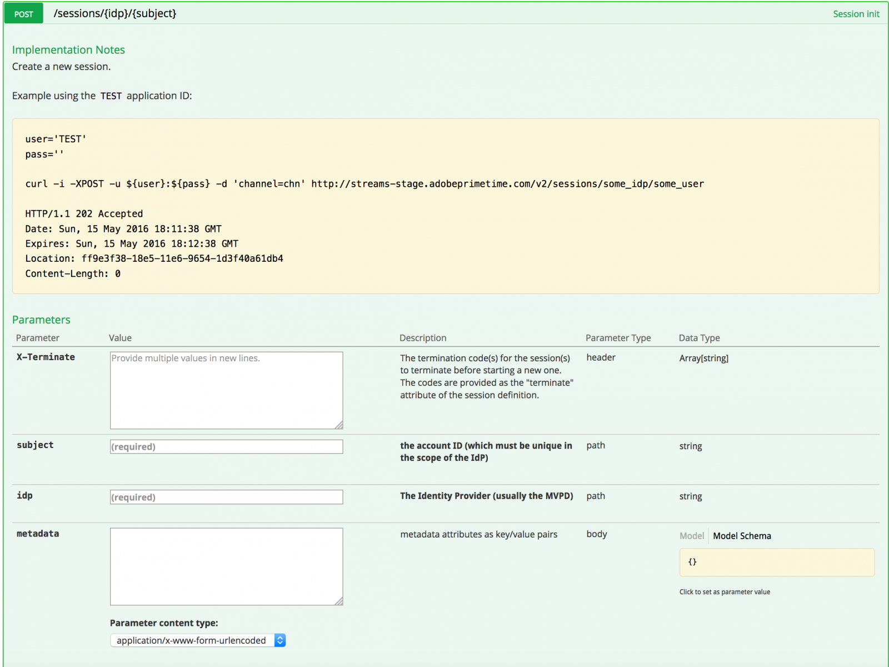

# Resumen de API {#api-overview}

Consulta la [documentación de la API en línea](http://docs.adobeptime.io/cm-api-v2/) para obtener más detalles.

## Objetivo y requisitos previos {#purpose-prerequisites}

Este documento ayuda a los desarrolladores de aplicaciones a utilizar nuestra especificación de API de Swagger al implementar una integración con la Monitorización de concurrencia. Es muy recomendable que el lector tenga una comprensión previa de los conceptos definidos por el servicio antes de seguir esta guía. Para tener esta comprensión, es necesario tener una visión general de la [documentación del producto](/help/concurrency-monitoring/cm-home.md) y la [especificación de la API Swagger](http://docs.adobeptime.io/cm-api-v2/).

## Introducción {#api-overview-intro}

Durante el proceso de desarrollo, la documentación pública de Swagger representa la guía de referencia para comprender y probar los flujos de API. Este es un buen punto de partida para tener un enfoque práctico y familiarizarse con la forma en que las aplicaciones del mundo real se comportarían en diferentes escenarios de interacción de usuarios.

Envíe un ticket en [Zendesk](mailto:tve-support@adobe.com) para registrar su compañía y sus aplicaciones en la Monitorización de concurrencia. El Adobe asignará un ID de aplicación a cada entidad. En esta guía usaremos dos aplicaciones de referencia con los identificadores **demo-app** y **demo-app-2** que estarán bajo el Adobe de inquilino.

## Casos de uso {#api-use-case}

El primer paso para probar un flujo con Swagger es introducir el ID de aplicación en la parte superior derecha de la página de esta manera:

Después de esto, presionamos **Explorar** para establecer el identificador que se usará en el encabezado Autorización para todas las llamadas realizadas a la API de REST.  Cada llamada a la API espera que el ID de aplicación se pase a través de la autenticación básica HTTP. El nombre de usuario es el ID de aplicación y la contraseña está vacía.

### Primera aplicación {#first-app-use-cases}

El equipo de Adobe ha asignado a la aplicación con el ID **demo-app** una directiva con una regla que restringe el número de flujos simultáneos a 3. Se asigna una póliza a una aplicación específica en función de la solicitud presentada en Zendesk.

#### Recuperando metadatos {#retrieve-metadata-use-case}

La primera llamada que realizamos es para el recurso de metadatos para obtener la lista de atributos de metadatos necesarios que se deben pasar como datos de formulario durante la inicialización de la sesión. Estos metadatos se utilizarán para evaluar las directivas asignadas a esta aplicación.

Después de pulsar &quot;Probar&quot;, para la aplicación con ID **demo-app** obtendremos el siguiente resultado:

Como podemos ver en el campo del cuerpo de respuesta, la lista de atributos de metadatos está vacía. Esto significa que los atributos requeridos por el diseño son suficientes para evaluar la directiva de 3 flujos asignada a esta aplicación. Consulte también la [documentación de campos de metadatos estándar](/help/concurrency-monitoring/standard-metadata-attributes.md). Después de esta llamada, podemos continuar y crear una nueva sesión en el recurso REST de sesiones.

#### Inicialización de sesión {#session-initial}

Una aplicación realiza la llamada de inicialización de sesión después de adquirir toda la información necesaria para realizarla.

No es necesario proporcionar ningún código de terminación en la primera llamada, ya que no tenemos ningún otro flujo activo. Y no hay atributo de metadatos, porque no se devolvió ninguno desde la llamada de recuperación de metadatos.

Los parámetros **subject** y **idp** son obligatorios. Se especificarán como variables de ruta de URI. Puede obtener los parámetros **subject** y **idp** realizando una llamada a los campos de metadatos **mvpd** y **upstreamUserID** desde la autenticación de Adobe Pass. Vea también la [descripción general de las API de metadatos](https://experienceleague.adobe.com/docs/primetime/authentication/auth-features/user-metadat/user-metadata-feature.html?lang=en#). Para este ejemplo, proporcionaremos el valor &quot;12345&quot; como asunto y &quot;adobe&quot; como idp.

Realice la llamada de inicialización de la sesión. Recibirá la siguiente respuesta:

Todos los datos que necesitamos están en los encabezados de respuesta. El encabezado **Location** representa el identificador de la nueva sesión creada, y los encabezados **Date** y **Expires** representan los valores que se usan para programar la aplicación de modo que realice el siguiente latido a fin de mantener viva la sesión.

#### Heartbeat {#heartbeat}

Haz una llamada de Heartbeat. Proporcione el **id. de sesión** obtenido en la llamada de inicialización de sesión, junto con los parámetros **subject** e **idp** utilizados.

Si la sesión sigue siendo válida (no ha caducado o se ha eliminado manualmente), recibirá un resultado satisfactorio:

Como en el primer caso, utilizaremos los encabezados **Date** y **Expires** para programar otro latido para esta sesión en particular. Si la sesión ya no es válida, esta llamada generará un error con el código de estado HTTP 410 GONE.

Puede utilizar la opción &quot;Mantener el flujo activo&quot; disponible en la interfaz de usuario de Swagger para ejecutar latidos automáticos en una sesión específica, lo que puede ayudarle a probar una regla sin tener que preocuparse por la plantilla necesaria para realizar latidos de sesión oportunos. Este botón se coloca junto al botón &quot;Probar&quot; en la pestaña Swagger Heartbeat. Para establecer un latido automático para todas las sesiones creadas, debe programarlas cada una en una interfaz de usuario de Swagger independiente abierta en una pestaña del explorador web.

#### Finalización de sesión {#session-termination}

El caso empresarial de su empresa puede requerir que la Monitorización de concurrencia termine una sesión específica cuando, por ejemplo, un usuario deje de ver un vídeo. Esto se puede hacer realizando una llamada al DELETE en el recurso de sesiones.

Utilice los mismos parámetros para la llamada que para el latido de la sesión. Los códigos de estado HTTP de respuesta son:

* 202 ACEPTADO para obtener una respuesta correcta
* 410 SE HA IDO si la sesión ya se ha detenido.

#### Obtener todos los flujos en ejecución {#get-all-running-streams}

Este extremo ofrece todas las sesiones que se están ejecutando para un inquilino específico en todas sus aplicaciones. Use los parámetros **subject** y **idp** para la llamada:

Cuando realice la llamada, obtendrá la siguiente respuesta:

Tenga en cuenta que el encabezado **Caduca**. Es el momento en que la primera sesión debe caducar a menos que se envíe un latido. OtherStreams tiene el valor 0 porque no hay otros flujos ejecutándose para este usuario en las aplicaciones de otro inquilino.
El campo de metadatos se rellenará con todos los metadatos enviados cuando comience la sesión. Si no lo filtramos, recibirá todo lo que haya enviado.
Si no hay sesiones en ejecución para un usuario específico al realizar la llamada, obtendrá esta respuesta:

Tenga en cuenta también que en este caso el encabezado **Expires** no está presente.

#### Infracción de la directiva {#breaking-policy-app-first}

Para simular el comportamiento de nuestra aplicación cuando se rompe la política de 3 flujos asignada a ella, necesitamos hacer 3 llamadas para la inicialización de la sesión. Para que la directiva surta efecto, las llamadas deben realizarse antes de que caduque una de las sesiones debido a la falta de latidos. Veremos que todas estas llamadas tienen éxito, pero si hacemos una cuarta, fallará con el siguiente error:

Obtenemos una respuesta 409 CONFLICT junto con un objeto de resultado de evaluación en la carga útil. Lea una descripción completa del resultado de la evaluación en la [especificación de API Swagger](http://docs.adobeptime.io/cm-api-v2/#evaluation-result).

La aplicación puede utilizar la información del resultado de la evaluación para mostrar un determinado mensaje al usuario al detener el vídeo y para realizar más acciones si es necesario. Un caso de uso puede ser detener otros flujos existentes para iniciar uno nuevo. Para ello, use el valor **terminateCode** presente en el campo **conflicts** para un atributo específico en conflicto. El valor se proporcionará como encabezado HTTP X-Terminate en la llamada para una nueva inicialización de sesión.

Al proporcionar uno o más códigos de finalización en la inicialización de la sesión, la llamada se realizará correctamente y se generará una nueva sesión. Entonces, si intentamos hacer un latido con una de las sesiones que se han detenido remotamente, obtendremos una respuesta 410 GONE con una carga útil de resultado de evaluación que describe el hecho de que la sesión se ha terminado remotamente, como en el ejemplo:

### Segunda aplicación {#second-application}

La otra aplicación de ejemplo que usaremos es la que tiene el ID **demo-app-2**. A este se le ha asignado una directiva con una regla que limita el número de flujos disponibles para un canal a un máximo de 2.   Debe proporcionar la variable channel para evaluar esta directiva.

#### Recuperando metadatos {#retrieving-metadata}

Establezca el nuevo ID de aplicación en la esquina superior derecha de la página y realice una llamada al recurso de metadatos. Recibirá la siguiente respuesta:

Esta vez, el cuerpo de respuesta ya no es una lista vacía, como en el ejemplo de la primera aplicación. Ahora el Servicio de supervisión de concurrencia indica en el cuerpo de respuesta que se requieren los metadatos **channel** en la inicialización de la sesión para evaluar la directiva.

Si realiza una llamada sin proporcionar un valor para el parámetro **channel**, obtendrá:

* Código de respuesta: 400 SOLICITUD INCORRECTA
* Cuerpo de respuesta: una carga útil de resultado de evaluación que describe en el campo **obligaciones** lo que se espera en la solicitud de inicialización de sesión para que la operación se realice correctamente.

#### Inicialización de sesión {#session-init}

Asigne un valor a la clave de metadatos requerida y configúrela como parámetro de formulario en la solicitud de inicialización de sesión, como se muestra a continuación:

Ahora la llamada se realizará correctamente y se generará una nueva sesión.

#### Infracción de la directiva {#breaking-policy-second-app}

Para romper la regla que tenemos en la política asignada a esta aplicación, necesitamos hacer 2 llamadas con el mismo valor de canal. Al igual que en el primer ejemplo, la segunda llamada debe realizarse mientras la primera sesión generada sigue siendo válida.

Si utilizamos valores diferentes para los metadatos de canal cada vez que creamos una nueva sesión, todas las llamadas se realizarán correctamente porque el umbral de 2 se establece para cada valor de forma individual.

Al igual que en el primer ejemplo, podemos usar el código de terminación para detener de forma remota los flujos en conflicto o podemos esperar a que uno de los flujos caduque, suponiendo que no se opere ningún latido en ellos.
