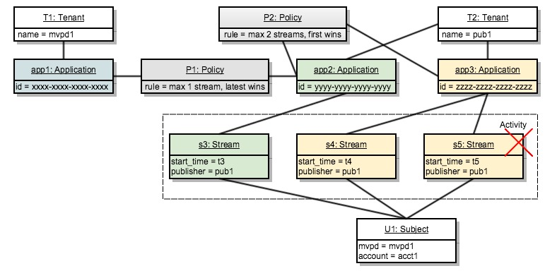

# Punto de decisión de política {#policy-desc-pt}

## Modelo de dominio {#domain-model}

Esta página está pensada para servir como referencia para diferentes casos de uso e implementaciones de directivas. Le recomendamos que consulte también la parte [Glosario](/help/concurrency-monitoring/cm-glossary.md) de la documentación para ver las definiciones de términos.

Un **inquilino** posee **aplicaciones** para las que desea aplicar **directivas**. **Las aplicaciones cliente** deben configurarse con el **identificador de aplicación** (proporcionado por Adobe).

A continuación, el inquilino asocia cada aplicación con una o más directivas, creadas por él o creadas y compartidas por otros. Las políticas se pueden vincular entre varios inquilinos.

La **actividad de asunto** consiste en todas las transmisiones (no importa la aplicación) que se comunican a la Monitorización de concurrencia para un asunto determinado.

Cuando se va a autorizar una secuencia para un asunto determinado, el sistema comprobará primero todas las directivas definidas para la aplicación que creó la secuencia.

Para cada una de las políticas aplicables, necesitamos recopilar toda la **actividad relevante** que se pasará a la regla. La **actividad relevante** para una directiva P solo incluirá una secuencia S si cumple la siguiente condición:

**La secuencia &quot;S&quot; es iniciada por una aplicación que incluye la directiva &quot;P&quot; entre sus directivas.**

## Casos de uso de Dry Run {#dry-run-use-cases}

El tutorial siguiente tiene como objetivo validar el modelo en algunos casos de uso. Lo haremos gradualmente, empezando con una configuración básica y agregando complejidad de varias maneras.

### &#x200B;1. Un usuario. Una aplicación. Una póliza. Un flujo {#onetenant-oneapp-onepolicy-onestream}

Empezaremos con un solo inquilino, con una sola aplicación y una sola directiva asociada. Supongamos que la política establece que puede haber como máximo un flujo activo para cualquier usuario (se permite reproducir el flujo más reciente).

Una vez iniciado un flujo, la actividad solo consistirá en ese flujo y se le permitirá reproducir.

### &#x200B;2. Un usuario. Una aplicación. Una póliza. Dos arroyos. {#onetenant-oneapp-onepolicy-twostreams}

Una vez que se inicia un segundo flujo (por el mismo sujeto que usa la misma aplicación), la actividad utilizada para la validación consistirá en **s1** y **s2**.

Se ha superado el límite porque la directiva establece que solo se permite reproducir un flujo, por lo que solo se permitirá reproducir el último (**s2**).

>[!NOTE]
>
>Los diagramas representan la vista del sistema en la actividad del usuario. Para los intentos de inicialización de una secuencia, la decisión de acceso se incluirá en la respuesta. Para los flujos activos, la decisión se devolverá en la respuesta de latido.

### &#x200B;3. Dos inquilinos. Dos aplicaciones. Una póliza. Dos arroyos. {#twotenant-twoapp-onepolicy-twostreams}

Supongamos ahora que un nuevo inquilino desea aplicar la misma directiva en sus aplicaciones:

Debido a que los dos inquilinos están vinculados por la misma directiva, la situación descrita en el caso de uso 2 es aplicable aquí y **s3** puede reproducirse ya que es el flujo más reciente.

### &#x200B;4. Dos inquilinos. Tres aplicaciones. Dos políticas. Dos arroyos. {#twotenants-threeapps-twopolicies-twostreams}

Ahora supongamos que el segundo inquilino implementa una nueva aplicación y desea definir una nueva directiva que se compartirá entre **app2** y **app3**.

En este momento, los flujos activos **s3** y **s4** están permitidos. Para **s3**, cuando se evalúe la directiva **P1**, el sistema solo contará **s3** como **actividad relevante** (**s4** no está relacionada de ninguna manera con la directiva **P1**), por lo que no hay infracción.

La directiva **P2** se ha aplicado a ambos flujos y incluirá **s3** y **s4** como actividad relevante. Como esta actividad se encuentra dentro de los límites de dos flujos, se permiten ambos flujos.

### &#x200B;5. Dos inquilinos. Tres aplicaciones. Dos políticas. Tres arroyos. {#twotenants-threeapps-twopolicies-threestreams}

Ahora, suponiendo que se realice un nuevo intento de inicialización de flujo usando **app2**:

**P1** permite el inicio de **s5** (lo que permite que se hagan cargo de los flujos más nuevos), pero **P2** lo ha denegado, por lo que no se iniciará.

Lo mismo ocurrirá si se intenta iniciar una secuencia con app3: la misma directiva P2 denegará el acceso para ella.

Ahora, veamos qué sucedería si el usuario intenta crear un nuevo flujo con app1:

La aplicación app1 de ninguna manera está relacionada con la directiva **P2**, por lo que solo aplicará la directiva **P1**: que permite que se inicie la nueva secuencia y deniega la anterior (**s3** en este caso).
