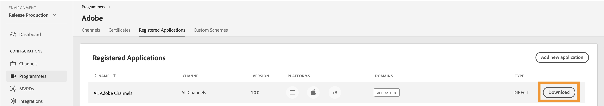

# Acceso a API de uso de supervisión de concurrencia {#cmu-api-usage-access}

>[!NOTE]
>
>El contenido de esta página se proporciona únicamente con fines informativos. El uso de esta API requiere una licencia actual de Adobe. No se permite el uso no autorizado. Póngase en contacto con su representante de Adobe para obtener más información sobre disponibilidad.

## Introducción al procedimiento de acceso {#api-access-procedure-overview}

Hemos actualizado el acceso a los informes de CMU para que sea compatible con el Protocolo de registro dinámico de clientes OAuth 2.0. Se implementa un servidor de autorización OAuth 2.0 personalizado para satisfacer las necesidades de la aplicación de Monitorización de concurrencia. \
Para que las aplicaciones cliente utilicen la autorización de OAuth 2.0, el servidor debe registrarse dinámicamente para obtener información específica (credenciales del cliente) para poder interactuar con ella. Como parte del proceso de registro, el cliente debe presentar un conjunto de metadatos integrados al extremo de registro del cliente.
Estos metadatos se comunican como una declaración de software, que contiene un &quot;software_id&quot; para permitir que nuestro servidor de autorización correlacione diferentes instancias de una aplicación utilizando la misma declaración de software.
Una instrucción de software es un token web JSON (JWT) que afirma valores de metadatos sobre el software cliente como un paquete. Cuando se presenta al servidor de autorización como parte de una solicitud de registro de cliente, la instrucción de software debe estar firmada digitalmente o ser editada en MAC mediante la firma web JSON (JWS). \
Puede encontrar una explicación más detallada sobre las instrucciones de software y cómo funcionan en la documentación oficial <a href="https://datatracker.ietf.org/doc/html/rfc7591" target="_blank">[RFC7591]</a>.
Siga los pasos de las secciones siguientes para obtener acceso.

## Pasos del procedimiento de acceso {#access-procedure-steps}

1. Tener una aplicación registrada en el servidor de Adobe Pass DCR. Para este paso, comuníquese con nuestro [Equipo de atención al cliente](mailto:tve-support@adobe.com).

2. Obtener la declaración del software
   1. Ir a [Panel de Adobe Pass TVE](https://experience.adobe.com/#/pass/authentication)
   2. Seleccionar programador
   3. Vaya a la ficha *Aplicaciones registradas*
   4. Seleccionar aplicación
   5. Haga clic en descargar en la fila de la aplicación registrada para la que desea obtener una declaración de software y guárdela como un archivo en el equipo local
      <figure>
          
      </figure>

      <figure>
          
      </figure>

3. Obtener token de acceso
   1. Obtenga las credenciales del cliente utilizando la instrucción de software obtenida anteriormente y realizando la llamada siguiente. De este modo se obtiene un par client_id - client_secret que se puede utilizar para obtener el token de acceso.
      *Este paso no se debe realizar cada vez. Solo debe hacerse de nuevo cuando caduquen las credenciales.*
      <figure>
          
       </figure>

   2. Obtenga el token de acceso mediante la siguiente llamada. Utilice este token de acceso para llamar a cualquier API de CMU hasta que el token caduque.
      *Este paso debe realizarse solamente si caducó el último token generado.*
      <figure>
          
       </figure>

4. Llamar a la API de CMU: consulte la información relacionada a continuación.
   <figure>
          
       </figure>

## Información relacionada {#related-information}

* [Información general de CMU](/help/concurrency-monitoring/reports/cm-usage-reports.md)
* [API de CMU](/help/concurrency-monitoring/reports/cmu-api.md)
